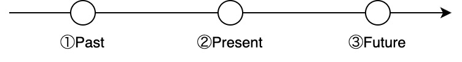
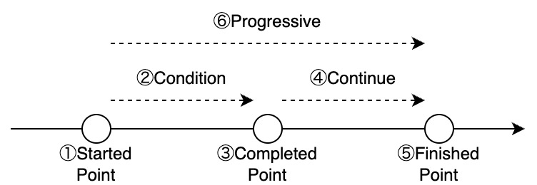
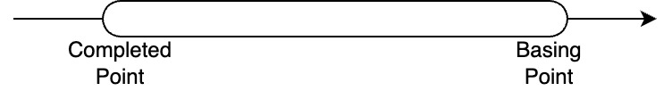

# 8. Verb Conjugation

[TOP](../../readme.md)
/
[JP](../jp/verbConjugation.md)

## Verb tenses

Verb tenses exist in the SFGPL as shown in the figure below.



Thus, there are three tenses in the SFGPL: ① past tense, ② present tense, and ③ future tense.
These tenses are fundamental to verb conjugation and serve as reference points for sentence time.
Example sentences using the tenses are shown in the following table.

|Tense|English|SFGPL|
|:-:|:-:|:-:|
|①Past Tense|I lived in Tokyo.|di ta ga na sa 'live' li pun fa 'Tokyo'|
|②Present Tense|I live in Tokyo.|ta ga na sa 'live' li pun fa 'Tokyo'|
|③Future Tense|I will live in Tokyo.|du ta ga na sa 'live' li pun fa 'Tokyo'|

In particular, ```di``` and ```du``` are attached to the sentence itself.

### Extended verb tenses

The verbs described in the previous section are the most basic way of expressing verb tenses.
However, in the SFGPL, there are words that are mainly used to combine tenses, depending on the DetermineV class.
The extended tense by the DeterminerV class has a lower priority than the base tense by the Phrase class, and the base tense basically represents the tense of the entire sentence.
The following table shows the words that represent the extended tense.

|Tense|Word|
|:-:|:-:|
|①Past Tense|bak|
|②Present Tense|bik|
|③Future Tense|bok|

These tenses can be combined to form compound tenses such as future past tense and past future tense.
The following is an example of the future past tense, which expresses the past at a future point in time.

```SFGPL
du ta ga na bak sa 'live' li pun fa 'Tokyo'
```

In summary, the tenses in the SFGPL are as shown in the table below.
The column names in the table below indicate the types of the base tense by Phrase, and the row names indicate the types of the extended tense by DeterminerV.
In ```A/B```, A denotes the base tense and B the extended tense.

||Past Tense|-|Future Tense|
|:-:|:-:|:-:|:-:|
|**-**|di/-|-/-|du/-|
|**Past Tense**|di/bak|-/bak|du/bak|
|**Present Tense**|di/bik|-/bik|du/bik|
|**Future Tense**|di/bok|-/bok|du/bok|

## Phases

In SFGPL, there are six phases as shown in the figure below: ①start phase, ②transitional phase, ③completion phase, ④continuation phase, ⑤finish phase, and ⑥progression phase.



The following table shows example sentences in each phase for ```te ga sa 'wear' fa 'dress'``` meaning "I wear dress".

|Phase|Word|English|SFGPL|
|:-:|:-:|:-:|:-:|
|①Start Phase|tak|I begin wear a dress.|te ga tak sa 'wear' fa 'dress'|
|②Transitional Phase|tek|I am (in the process of) wearing a dress.|te ga tek sa 'wear' fa 'dress'|
|③Completion Phase|tik|I wear a dress. (I just finished wearing it.)|te ga tik sa 'wear' fa 'dress'|
|④Continuation Phase|tuk|I am wearing a dress. (The state in which it is worn.)|te ga tuk sa 'wear' fa 'dress'|
|⑤Finish Phase|tok|I finish wear a dress. (I stopped wearing it.)|te ga tok sa 'wear' fa 'dress'|
|⑥Progression Phase|ni|I am wearing a dress.|te ga ni sa 'wear' fa 'dress'|

These phases can be in the past or future tense in addition to the present tense.
⑥ Progressive phase includes ② transitional phase and ④ continuation phase.
There are also cases where ③ the completion phase and ⑤ the finish phase are the same.
"I begin wear a dress." in the past and future tenses is as follows.

```SFGPL
di te ga tak sa 'wear' fa 'dress'
du te ga tak sa 'wear' fa 'dress'
```

As a rule, a phase alone does not indicate a range of time, but only the moment in which it occurs.
When expressing a range of time, the perfect tense is added.
The progressive form plus the perfect form to express "I have been wearing a dress.".

```SFGPL
te ga nu ni sa 'wear' fa 'dress'
```

### General progressive form

In SFGPL, we can make a simple progressive form as in ⑥ without considering the phases ① to ⑤ in the previous section.
The SFGPL can be expressed in the progressive form meaning "I am wearing the dress." as follows.

```te ga ni sa 'wear' fa 'dress'```

Progressive forms ```ni``` are attached to verbs.
They can be past or future tense as well as present tense.
"I am wearing the dress." in the past and future tenses is as follows.

```SFGPL
di te ga ni sa 'wear' fa 'dress'
du te ga ni sa 'wear' fa 'dress'
```

## Perfect tense

In the SFGPL, there is a perfect tense equivalent to English, as shown in the figure below.



This perfect tense is used to indicate that something that has happened in the past is continuing.
Examples of the perfect tense for the three tenses are as follows.

|Tense|English|SFGPL|
|:-:|:-:|:-:|
|①Past Perfect Tense|I had lived in Tokyo.|di ta ga nu na sa 'live' li pun fa 'Tokyo'|
|②Present Perfect Tense|I have lived in Tokyo.|ta ga nu na sa 'live' li pun fa 'Tokyo'|
|③Future Perfect Tense|I will have lived in Tokyo.|du ta ga nu na sa 'live' li pun fa 'Tokyo'|

In ```nu```, the perfective form is attached to and modifies the verb itself.

## Passive voice

SFGPL can express the passive voice with the meaning "The dress is worn.".

```ta fa 'dress' ne sa 'wear'```

The ```ne```, which indicates the passive form, is attached to the verb.
These can be in the past or future tense as well as the present tense.
"The dress is worn." in the past and future tenses is as follows.

```SFGPL
di ta fa 'dress' ne sa 'wear'
du ta fa 'dress' ne sa 'wear'
```

## Other verb modifiers

Functions in the [DeterminerV](DeterminerV.md) class can modify other verbs.
They are similar to English auxiliary verbs.

## Wordbook

|English|SFGPL|
|:-:|:-:|
|I|ga|
|live|sa 'live'|
|in Tokyo|li pun fa 'Tokyo'|
|wear|sa 'wear'|
|dress|fa 'dress'|
