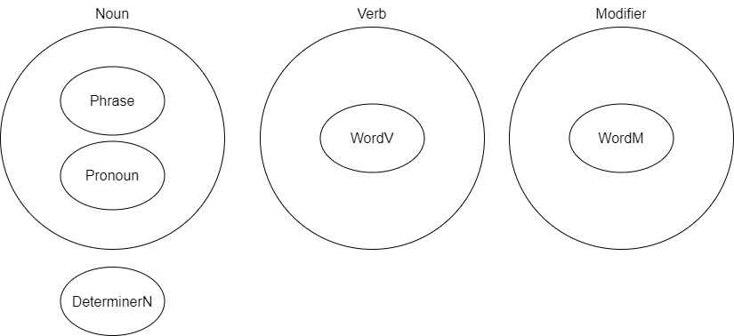

<div class="tex_part" text="SFGPLの概要と基礎的な文法"></div>

# 1. SFGPLについて
<div id="tex_section_label_1"></div>

## はじめに

SFGPLは"Simple Functional General Purpose Language"の略で，自然言語を形式化するための言語である．
この言語は，文の構造や意味を容易に解釈でき，かつコミュニケーションができるようにするために考案した言語である．

また，この言語は私が趣味で作成したものであり，厳密に検証を行っていないため不備等がある可能性がある．

そして，このプロジェクトでは，GitHub:[https://github.com/Eruhitsuji/SFGPL](https://github.com/Eruhitsuji/SFGPL)において，資料やプログラムを公開している．

## SFGPL作成の背景と目的

多くの自然言語の文法では，多くの例外や存在し，学習者を悩ませることが多い．
また，それを解決するために，世界共通語を目的とした人工言語が提案されたが，それらは多くの自然言語と同様に曖昧な意味や複数の解釈ができる場合が存在する．
特に，接続詞や関係代名詞などを含む，長くて複雑な文章は解釈が困難であることが多い．
それらを解決するために，形式的，論理的に理解できるような言語を目的として作成した人工言語がSFGPLである．

## SFGPLの特徴

SFGPLでは，関数型の言語で，また関数のとる引数の型が厳密に定義されている．
SFGPLでは，文構造それぞれに関数が割り振られているため，主語，述語，目的語，補語などの文法上の役割が分かりやすくなっている．
また，文構造を組み合わせることによって複雑な文章を作成することができる．

## SFGPLの基本文法

- SFGPLには機能語と少しの単語のみが存在し，厳密に定義された意味を持つ．その他の単語は他の言語から借用される．
- 機能語の後にはいくつかの引数が付き，その引数によって意味が決まる．
- 原則として，各引数は1つの単語または1つのオブジェクトに対応するが，原語が複数の単語である場合は，アンダースコアで接続することで1つの単語とみなすことができる．
- 借用語の前後にはシングルクォーテーションを付けることで区別する．
- 文法上の性や数などの区別をすることはなく，また，冠詞も存在しない．
- 文末にはセミコロン(;)を付ける．ただし，単文の場合は省略可能である．

### SFGPLの文構造

SFGPLの語順はSVOであるが，文頭に文の構造を決定する機能語が付属する．
また，SFGPLでは固有語によって，文構造が厳密に定義されている．
以下の表は，SFGPLで表現できる文構造の表である．
また使用方法等の詳細は，[文型](#3-文型)に記述してある．

|||単語|関数|引数|補足|
|:-:|:-:|:-:|:-:|:-:|:-:|
|1|S V|ta|Noun.do|S,V||
|2|S V C|ma|Noun.eq|S,V,C|Cが名詞|
|2|S V C|me|Noun.haveP|S,V,C|Cが修飾語|
|3|S V O|te|Noun.doT|S,V,O||
|4|S V O1 O2|ti|Noun.give|S,V,O1,O2||
|5|S V O C|tu|Noun.makeN|S,V,O,C|Cが名詞|
|5|S V O C|to|Noun.makeM|S,V,O,C|Cが修飾語|
|-|A has B|mi|Noun.have|A,V,B|AがBを所有している|
|-|A belongs to B|mu|Noun.belong|A,V,B|AがBに所属している|
|-|A is more B than C|mo|Noun.gt|A,V,B,C|AがCよりBである|
|-|According to C, A V B|moa|Noun.hearSay|A,V,B,C|<div class="long_td">Bという内容をCという<br>情報源から，AはFする</div>|

## SFGPLの発音

SFGPLの固有単語においては，発音の例外が存在しない．
また，以下の表の国際音声記号(IPA)は発音例である．

SFGPLの子音は次の表のようなものがある．

|表記|IPA|
|:-:|:-:|
|p|/p/|
|b|/b/|
|f|/f/|
|m|/m/|
|t|/t/|
|d|/d/|
|s|/s/|
|n|/n/|
|l|/l/|
|k|/k/|
|g|/g/|
|w|/w/|

一方，SFGPLの母音は次の表のようなものがある．
SFGPLの固有語は，数少ない単語を除いて二重母音は存在しない．

|表記|IPA|
|:-:|:-:|
|a|/a/|
|e|/e/|
|i|/i/|
|u|/u/|
|o|/o/|
|ua|/ua/|

また，借用語は借用語固有の発音で読む．

## SFGPLの単語

SFGPLの[単語](#10-単語)は主に，SFGPLの固有の単語と借用語に分かれる．

固有単語は，主に文構造に必要な機能語と，動詞と修飾語の基礎単語が存在する．
またそれ以外は，借用語が使用される．

そして，SFGPLの文構造では，品詞の場所が決定されており，それに従った品詞の単語を使わなければならない．

### SFGPLの品詞

SFGPLの品詞は名詞(Noun)，動詞(Verb)，修飾詞(Modifier)の三種類がある．
また，名詞のサブクラスとして句(Phrase)，代名詞（Pronoun），Bool配列型（BoolList），LangList，LangFuncとNumberListが存在する．

BoolList，LangList，LangFuncは一般的な文以外に論理的な文を作る際に使用される．
そして，真偽を表すBool型が存在する．

NumberListは主に数詞として使われる．
また，基数詞としてのNumberクラスが存在する．
このNumberクラスは通常単体で使われない．

さらに，名詞や動詞を修飾する特殊な語として，名詞限定語（DeterminerN）と動詞限定語（DeterminerV）が存在する．

それぞれの品詞にはそれぞれ特有の関数（機能語）が存在し，それによって品詞の変更や意味の決定などが行われる．
その他に，基礎単語を実装する，単語（Word）が存在する．
単語は，品詞別に動詞の単語の"WordV"，修飾語の単語の"WordM"が存在する．

名詞は，あらゆる物体，物質，人物，場所などのあらゆる概念を表す語である．
動詞は，あらゆる動作，作用，状態，存在などを表す語である．
修飾語は，他の語を修飾する語である．SFGPLでは形容詞と副詞の区別はつけない．

PythonライブラリSFGPLでは品詞ごとにクラスが存在する．



### SFGPLの機能語

機能語により，文の役割や品詞等の決定がされる．
機能語の機能，役割や意味は引数内でのみしか適応されない．

この機能語らは，Pythonの関数と一対一となっている．
また，引数の数も決まっていて，引数の場所によって，役割が決まっている．

機能語の一覧と利用方法は，[dict.csv](../../dict.csv)に記述されている．

### SFGPLの借用語

SFGPLで存在しない単語は借用語を使用する．
借用語は，英語などの世界でよく使われる言語から借用することが好ましいが，相手に伝わる単語であれば問題とはならないはずである．
ただし，借用語は原型で使い，活用がある場合はSFGPLの機能語で行うことを推奨している．

## SFGPLとプログラミング

SFGPLの文は，Pythonオブジェクトに書き換えることができる．
このプロジェクトは，SFGPLが定義されているファイルが含まれている．
PythonでSFGPLを使用するためには，[SFGPL.py](../../SFGPL/SFGPL.py)をインポートすることで使用することができる．
使用例は[samples](../../py/samples)のPythonファイルに記載されている．
また，PythonでのSFGPLライブラリの詳細な実行方法は，[How_to_Use_SFGPL_in_Python.ipynb](../../How_to_Use_SFGPL_in_Python.ipynb)に記載されている．

# 2. 基本文法
<div id="tex_section_label_2"></div>

この資料では，SFGPLを学ぶための基本的知識や文法を説明する．
また前提として[aboutSFGPL](#1-sfgplについて)を読んでおくことを推奨する．

## SFGPL文構造の特徴について

SFGPLでは英語と同様に，SOV型で語の役割が位置で決まる言語である．
また，SFGPLの最大の特徴として，[文型](#3-文型)が重視されていることが挙げられる．
この文型は，それぞれどのような引数（どのような品詞の単語）を何個とるかが定義されている．
そのため，文の意味が一意に決まる．
また，この文型を決定する機能語が文（句）の先頭に付属する．
そして，この文（句）全体では，名詞としてみなされ，入れ子的に文を作ることができる（[複文](#7-複文)）．

## SFGPLの文型の具体例

### taによる構文

まず，```ta```を使用した例を提示する．
この```ta```では，2つの引数を持ち，第一引数が文の主語，第二引数が文の動詞を表す．
つまり，```ta```では，英語の第一文型SVと同等の文を作ることができる．

例としてSFGPLで"I run."を表すには次のようにする．

```SFGPL
ta ga sa 'run'
```

このとき，```ta```は，文型が"SV"のときに付ける語である．

また，```ga```は，一人称代名詞"I"を表す．

そして，```sa 'run'```は，動詞"run"を表す．
この```sa 'run'```は2単語から構成されている．
このような借用語などでは，品詞を表す語（この場合は動詞を表す，```sa```）が付いている．
このような品詞を表す語は，次の3つが存在する．

||SFGPL|
|:-:|:-:|
|名詞|fa|
|動詞|sa|
|修飾語|la|

### maによる構文

次に，```ma```を使用した例を提示する．
この```ma```は3つの引数を持ち，第一引数が文の主語，第二引数が文の動詞，第三引数が主語に対する補語を表す．
また，第三引数の補語は名詞でないといけない．
つまり```ma```では，英語の第二文型SVCと同等の文を作ることができる．

例としてSFGPLで"I am a student."を表すには次のようにする．

```SFGPL
ma ga so fa 'student'
```

このとき，```ma```は，文型が"SVC"のときに付ける語である．

また，```ga```は，一人称代名詞"I"を表す．

次に，```so```は，動詞が無意味であることを示す単語である．
この```so```では，場所によって意味が変わる．
このとき例文のときは，英語のbe動詞と同等の意味となる．

そして，```fa 'student'```は，名詞"student"を表す．
このとき，英語などにある冠詞はSFGPLでは存在しないため，何もつけなくても良い．

### meによる構文

次に，```me```を使用した例を提示する．
この```me```は3つの引数を持ち，第一引数が文の主語，第二引数が文の動詞，第三引数が主語に対する補語を表す．
また，第三引数の補語は修飾語でないといけない．
つまり```me```では，英語の第二文型SVCと同等の文を作ることができる．

例としてSFGPLで"I am happy."を表すには次のようにする．

```SFGPL
me ga so la 'happy'
```

このとき，```me```は，文型が"SVC"のときに付ける語である．

また，```ga```は，一人称代名詞"I"を表す．

次に，```so```は，動詞が無意味であることを示す単語である．
この```so```では，場所によって意味が変わる．
このとき例文のときは，英語のbe動詞と同等の意味となる．

そして，```la 'happy'```は，修飾語"happy"を表す．

### teによる構文

そして，```te```を使用した例を提示する．
この```te```は3つの引数を持ち，第一引数が文の主語，第二引数が文の動詞，第三引数が目的語を表す．
つまり，```te```では，英語の第三文型のSVOと同等の文を作ることができる．

例としてSFGPLで"I open the door."を表すには次のようにする．

```SFGPL
te ga sa 'open' fa 'door'
```

このとき，```te```は，文型が"SVO"のときに付ける語である．

また，```ga```は，一人称代名詞"I"を表す．

次に，```sa 'open'```は，動詞"open"を表す．

そして，```fa 'door'```は，名詞"door"を表す．

### その他の構文

その他の構文は，[文型](#3-文型)で示されている．

## 単語集

|English|SFGPL|
|:-:|:-:|
|I|ga|
|run|sa 'run'|
|student|fa 'student'|
|happy|la 'happy'|
|open|sa 'open'|
|door|fa 'door'|

<div class="tex_part" text="SFGPLの構文"></div>

# 3. 文型
<div id="tex_section_label_3"></div>

## SFGPLの文型の一覧

SFGPLでは，文を構成するためには，必ず文型を決定する機能語が文の先頭に付属する．
SFGPLでは以下の表のような文型が存在し，それらの文の組み合わせにより，文自体が構成される．また，単語の修飾なども行われる．

|||単語|関数|引数|補足|
|:-:|:-:|:-:|:-:|:-:|:-:|
|1|S V|ta|Noun.do|S,V||
|2|S V C|ma|Noun.eq|S,V,C|Cが名詞|
|2|S V C|me|Noun.haveP|S,V,C|Cが修飾語|
|3|S V O|te|Noun.doT|S,V,O||
|4|S V O1 O2|ti|Noun.give|S,V,O1,O2||
|5|S V O C|tu|Noun.makeN|S,V,O,C|Cが名詞|
|5|S V O C|to|Noun.makeM|S,V,O,C|Cが修飾語|
|-|A has B|mi|Noun.have|A,V,B|AがBを所有している|
|-|A belongs to B|mu|Noun.belong|A,V,B|AがBに所属している|
|-|A is more B than C|mo|Noun.gt|A,V,B,C|AがCよりBである|
|-|According to C, A V B|moa|Noun.hearSay|A,V,B,C|<div class="long_td">Bという内容をCという<br>情報源から，AはFする</div>|

## Noun.do (ta)

Noun.do ```ta```では，特に，英語の第一文型と同じ形のSが主語，Vが動詞で，主語が何かの動作をするという．単純な文章を表すことができる．
"I run."をSFGPLで表すには，次のようになる．

```SFGPL
ta ga sa 'run'
```

## Noun.eq (ma)

Noun.eq ```ma```では，特に，英語の第二文型である"S is C"に相当し，その中でも，補語Cが名詞であるものを表す表すことができる．
また，この構文ではSとCが等価であることも示している．
Vが英語でbe動詞に相当する場合，動詞として```so```を使用する．
"This is a table."をSFGPLで表すには，次のようになる．

```SFGPL
ma gu so fa 'table'
```

"You become a teacher."をSFGPLで表すには，次のようになる．

```SFGPL
ma ge sa 'become' fa 'teacher'
```

## Noun.haveP (me)

Noun.haveP ```me```では，特に，英語の第二文型である"S is C"に相当し，その中でも，補語Cが修飾語であるものを表すことができる．
また，この構文ではSがCという性質や状態であるということを表す．
Vが英語でbe動詞に相当する場合，動詞として```so```を使用する．
"The table is red."をSFGPLで表すには，次のようになる．

```SFGPL
me fa 'table' so la 'red'
```

"You look sad."をSFGPLで表すには，次のようになる．

```SFGPL
me ge sa 'look' la 'sad'
```

## Noun.doT (te)

Noun.doT ```te```では，特に，英語の第三文型に相当し，Sが主語，Vが動詞，Oが目的語である．
"I study English."をSFGPLで表すには，次のようになる．

```SFGPL
te ga sa 'study' fa 'English'
```

## Noun.give (ti)

Noun.give ```ti```では，特に，英語の第四文型に相当し，Sが主語，Vが動詞，O1とO2が目的語である．特に，この構文では，SがO1にO2をVするという意味となる．
Vが英語で"give"に相当する場合，動詞として```so```を使用する．
"I give you a table."をSFGPLで表すには，次のようになる．

```SFGPL
ti ga so ge fa 'table'
```

## Noun.makeN (tu)とNoun.makeM (to)

Noun.makeN ```tu```とNoun.makeM ```to```では，特に，英語の第五文型に相当し，Sが主語，Vが動詞，Oが目的語，Cが補語である．
Noun.makeNはCが名詞，Noun.makeMはCが修飾語のときに使用する．
この構文では"SがOをCにさせる"という意味になる．
Vが英語で"make"に相当する場合，動詞として```so```を使用する．

"I make you a teacher."をSFGPLで表すには，次のようになる．

```SFGPL
tu ga so ge fa 'teacher'
```

"I make you sad."をSFGPLで表すには，次のようになる．

```SFGPL
to ga so ge la 'sad'
```

## Noun.have (mi)

Noun.have ```mi```は"AがBを所有している"という意味になる．
Vが英語で"have"に相当する場合，動詞として```so```を使用する．
"I have a table."をSFGPLで表すには，次のようになる．

```SFGPL
mi ga so fa 'table'
```

## Noun.belong (mu)

Noun.belong ```mu```は"AがBに所属している"という意味になる．
Vが英語で"belong to"に相当する場合，動詞として```so```を使用する．
"I belong to a school."をSFGPLで表すには，次のようになる．

```SFGPL
mu ga so fa 'school'
```

## Noun.gt (mo)

Noun.gt ```mo```は"AはCよりBである"という意味になる．
このときAとBが比較対象の名詞，Cは修飾語である．
Vが英語でbe動詞に相当する場合，動詞として```so```を使用する．
"The bed is bigger than yours."をSFGPLで表すには，次のようになる．

```SFGPL
mo fa 'bed' so wan sen ge
```

## Noun.hearSay (moa)

Noun.hearSay ```moa```は"Bという内容をCという情報源から，AはVする"という意味になる．
このとき，Aは情報を受け取った人や物，Vは動詞，Bは情報の内容，Cは情報源の人や物である．
Vが英語でhear，sayやseeなどの伝聞に関する動詞に相当する場合，動詞として```so```を使用する．
"According to the book, I saw that Japan is located in East Asia."をSFGPLで表すには，次のようになる．

```SFGPL
di moa ga so ta fa 'Japan' na ne sa 'locate' li fun pun me fa 'Asia' so la 'east' fa 'book'
```

## 文構造を使用した名詞の修飾方法

SFGPLでは名詞の修飾を行う際に，これらの文構造を使用する．
また，文が生成されたとき，その全体は名詞となり，それを別の文に埋め込むことができる．

"Your table is red."をSFGPLで表すには，次のようになる．

```SFGPL
me mi ge so fa 'table' so la 'red'
```

このように"You have table"である```mi ge so fa 'table'```が主語となり，そのテーブルが赤い```la 'red'```ということが説明できる．
また，同等の意味である，"You have red table."は次のように表すことができる．

```SFGPL
mi ge so me fa 'table' so la 'red'
```

### 強調形

特に文中で主語以外の単語を強調したい場合には，強調形 ```san```を使用する事もできる．
"Your table is red."のtableを強調形にするためには次のようにする．

```SFGPL
me mi ge so san fa 'table' so la 'red'
```

## 単語集

|English|SFGPL|
|:-:|:-:|
|I|ga|
|run|sa 'run'|
|this|gu|
|table|fa 'table'|
|red|la 'red'|
|you|ge|
|become|sa 'become'|
|teacher|fa 'teacher'|
|look|sa 'look'|
|sad|la 'sad'|
|study|sa 'study'|
|English|fa 'English'|
|school|fa 'school'|
|bed|fa 'bed'|
|big|wan|
|yours|sen ge|
|book|fa 'book'|
|Japan|fa 'Japan'|
|in East Asia|li fun pun me fa 'Asia' so la 'east'|

# 4. 否定文
<div id="tex_section_label_4"></div>

否定文を作成するためには```pa```を使用する．
この語は，文章に付属することで否定文を作る．
"I have a table."はSFGPLでは```mi ga so fa 'table'```である．
それを否定文の"I don't have a table."という意味にする場合，SFGPLでは次のように表現できる．

```SFGPL
pa mi ga so fa 'table'
```

## 単語集

|English|SFGPL|
|:-:|:-:|
|I|ga|
|table|fa 'table'|

# 5. 疑問文
<div id="tex_section_label_5"></div>

疑問文を作成するためには```da```を使用する．
この単語を文につけると疑問文になる．
"You have a table."はSFGPLでは```mi ge so fa 'table'```である．
それを疑問文の"Do you have a table?"という意味にする場合，SFGPLでは次のように表現できる．

```SFGPL
da mi ge so fa 'table'
```

また，疑問詞を含む疑問文の場合，不定のところを疑問詞に置き換えることで表す．

"Who has a table?"は次のように表す．

```SFGPL
da mi ben wa so fa 'table'
```

"What do you have?"は次のように表す．

```SFGPL
da mi ge so pen wa
```

## 単語集

|English|SFGPL|
|:-:|:-:|
|you|ge|
|table|fa 'table'|
|who|ben wa|
|what|pen wa|

# 6. 命令文
<div id="tex_section_label_6"></div>

命令文を作成するためには```de```を使用する．
この単語を文につけると命令文になる．
"You buy a table."はSFGPLでは```te ge sa 'buy' fa 'table'```である．
それを命令文の"Buy a table, you!"という意味にする場合，SFGPLでは次のように表現できる．

```SFGPL
de te ge sa 'buy' fa 'table'
```

## 単語集

|English|SFGPL|
|:-:|:-:|
|you|ge|
|buy|sa 'buy'|
|table|fa 'table'|

# 7. 複文
<div id="tex_section_label_7"></div>

SFGPLでは1つの文の中に，複数のを組み合わせて表す文を作成することができる．

## 並列節

2つ以上の文を並列に接続するためには，[接続詞](#13-接続詞)が使用される．

SFGPLで，"I went to Tokyo and I was shopping there."を表すには次のようにする．

```SFGPL
ba di ta ga na sa 'go' li pun fa 'Tokyo' di ta ga na ni sa 'shop' li pun gu
```

また，英語のような時制の一致をするにはこのように節ごとに時制を活用させるが，SFGPLでは文全体に基本時制を活用させることができる．

```SFGPL
di ba ta ga na sa 'go' li pun fa 'Tokyo' ta ga na ni sa 'shop' li pun gu
```

## 従属節

主節内の名詞に対して従属的に修飾するためには，その名詞の代わりにその名詞を説明する文を入れることで実現できる．
また，SFGPLでは一般的に，名詞を修飾する場合には従属節を使用することが多い．

### 一般的な従属節

SFGPLで，"My bag is big."を表すには次のようにする．
またこのときの"My bag"は，"I have a bag"であるというように表現する．
そしてこのとき，"bag"が修飾されている名詞であるため，その名詞には```san```を付ける．

```SFGPL
me mi ga so san fa 'bag' so wan
```

また，意味がほぼ同じである，"I have a bag is big."を表すには次のようにする．
またこのときは，"a bag is big"の"bag"は従属節の主語となっているため，```san```を付けなくても良い．

```SFGPL
mi ga so me fa 'bag' so wan
```

そして，"I give you the desk I built."を表すには次のようにする．

```SFGPL
ti ga so ge di te ga sa 'build' san fa 'desk'
```

このように従属節だけの時制を変えることもできる．

### 副詞節

副詞節で述語や文全体に対して修飾することができる．
SFGPLで"I ate sushi, when I went to Tokyo."を表すには次のようにする．

```SFGPL
di te ga na sa 'eat' li ta ga na sa 'go' li pun fa 'Tokyo' fa 'sushi'
```

また，SFGPLで"I went grocery shopping while my kids were sleeping."を表すためには次のようにする．

```SFGPL
di ta ga na sa 'go' ba li ma fi ni sa 'shop' so fa 'grocery' li ta mi ga so san don fa 'kid' ni sa 'sleep'
```

## 名詞による名詞の修飾

ある名詞XとYにおいて，YがXを修飾するとき，日本語では"YのX"，英語では"Y X"または"X of Y"と表されるがSFGPLでは，主に3種類の用法を使い分けて使用する．
SFGPLでは，先述のように，従属節で修飾をすることが多いが，名詞を名詞で修飾する場合も例外ではない．
そのため名詞の修飾方法は，```ma```，```mi```と```mu```で使い分けられる．

### Noun.eq (ma)

まず，```ma```では，主に修飾語と被修飾語が同等のもののときに使われる．
例えば"This pen is big."をSFGPLで表すには次のようにする．

```SFGPL
me ma gu so san fa 'pen' so wan
```

このとき，"this"と"pen"は同等のものを指している．
そのため，```ma```が使われる．

### Noun.have (mi)

次に，```mi```では，主に何かが何かを持ているときに使われる．
SFGPLで"My pen is big."を表すには次のようにする．

```SFGPL
me mi ga so san fa 'pen' so wan
```

### Noun.belong (mu)

また，```mu```では，主に何かがなにかに所属しているときに使われる．
SFGPLで"My school is big."を表すには次のようにする．

```SFGPL
me mu ga so san fa 'school' so wan
```

## 単語集

|English|SFGPL|
|:-:|:-:|
|I|ga|
|go|sa 'go'|
|to Tokyo|li pun fa 'Tokyo'|
|shop (Verb)|sa 'shop'|
|there|pun gu|
|bag|fa 'bag'|
|big|wan|
|you|ge|
|build|sa 'build'|
|desk|fa 'desk'|
|eat|sa 'eat'|
|sushi|fa 'sushi'|
|grocery|fa 'grocery'|
|kid|fa 'kid'|
|sleep|sa 'sleep'|
|this|gu|
|pen|fa 'pen'|
|school|fa 'school'|

# 8. 動詞の活用方法
<div id="tex_section_label_8"></div>

SFGPLでは，時制や相，助動詞などの動詞を修飾する語が備わっている．
これらの語は，主に，動詞に直接付属し修飾するものと，文全体に修飾するものが存在する．

## 動詞の時制

SFGPLでは以下の図のような動詞の時制が存在する．


このように，SFGPLでは①過去形，②現在形，③未来形の3つの時制が存在する．
これら時制は動詞の活用として基礎的なもので，文の時間の基準点となる．
時制を使用した例文は次の表のようになる．

|時制|English|SFGPL|
|:-:|:-:|:-:|
|①過去形|I lived in Tokyo.|di ta ga na sa 'live' li pun fa 'Tokyo'|
|②現在形|I live in Tokyo.|ta ga na sa 'live' li pun fa 'Tokyo'|
|③未来形|I will live in Tokyo.|du ta ga na sa 'live' li pun fa 'Tokyo'|

特に```di```と```du```では，文章自体に付属し形容する．

また，②の現在形は，何も付属しないことで，通常は現在のことを表す．
しかし，本来は不定時制であり，特に時制を必要としない場合にも使われる．

### 動詞の拡張時制

前項で説明した動詞は，一番基本的な動詞の時制の表し方である．
しかし，SFGPLではDeterminVクラスにによって，主に時制を組み合わせるための単語が存在する．
また，このDeterminerVクラスによる拡張時制は，Phraseクラスによる基礎時制より優先度が低く，基本的には基礎時制で文全体の時制を表す．
以下の表は拡張時制を表す単語である．

|時制|単語|
|:-:|:-:|
|①過去形|bak|
|②現在形|bik|
|③未来形|bok|

これらの時制を組み合わせることで，未来過去形や過去未来形などの複合時制を作ることができる．
次の例は，未来の時点で過去を表す未来過去形の例である．  

```SFGPL
du ta ga na bak sa 'live' li pun fa 'Tokyo'
```

まとめるとSFGPLにおける時制は以下の表のようなものが存在する．
以下の表の列名はPhraseによる基礎時制の種類，行名はDeterminerVによる拡張時制の種類を表している．
また，```A/B```でAは基礎時制，B拡張時制を表す，

||Past Tense|-|Future Tense|
|:-:|:-:|:-:|:-:|
|**-**|di/-|-/-|du/-|
|**Past Tense**|di/bak|-/bak|du/bak|
|**Present Tense**|di/bik|-/bik|du/bik|
|**Future Tense**|di/bok|-/bok|du/bok|

## 動作の時間軸に関する相

SFGPLでは下の図のように，①起動相，②経過相，③完結相，④継続相，⑤終了相，⑥進行相の6つが存在する．


"I wear dress"という意味の```te ga sa 'wear' fa 'dress'```について，それぞれの相での例文を次の表に示す．

|相|単語|English|SFGPL|
|:-:|:-:|:-:|:-:|
|①起動相|tak|I begin wear a dress.|te ga tak sa 'wear' fa 'dress'|
|②経過相|tek|I am (in the process of) wearing a dress.|te ga tek sa 'wear' fa 'dress'|
|③完結相|tik|I wear a dress. (I just finished wearing it.)|te ga tik sa 'wear' fa 'dress'|
|④継続相|tuk|I am wearing a dress. (The state in which it is worn.)|te ga tuk sa 'wear' fa 'dress'|
|⑤終了相|tok|I finish wear a dress. (I stopped wearing it.)|te ga tok sa 'wear' fa 'dress'|
|⑥進行相|ni|I am wearing a dress.|te ga ni sa 'wear' fa 'dress'|

①起動相，③完結相，⑤終了相では，ある動作に対しての瞬間の一点だけを表す．

②経過相，④継続相，⑥進行相は，ある動作に対しての期間を表す．
⑥進行相は②経過相と④継続相が含まれた，不明瞭な期間を表す．
また，一部の動詞では，それぞれとの相との間が一瞬であり，ほとんど区別できない場合がある．

これらの相は，現在形以外にも，過去形，未来形にできる．
"I begin wear a dress."を過去形，未来形にすると次のようになる．

```SFGPL
di te ga tak sa 'wear' fa 'dress'
du te ga tak sa 'wear' fa 'dress'
```

また，原則としてこれらの相単体では，ある時点にフォーカスをした動作を表している．
特に，その時点より過去からその動作が続いている場合を強調して示すためには，それらの相に加えて完了形を使用し表現する．
進行形に完了形を加えた"I have been wearing a dress."を表すには，次のようになる．

```SFGPL
te ga nu ni sa 'wear' fa 'dress'
```

### 一般的な進行形

SFGPLでは前節の①～⑤のような相を考えずに，⑥のように単純な進行形にすることができる．
SFGPLは次のように，"I am wearing the dress."という意味の進行形を表すことができる．

```SFGPL
te ga ni sa 'wear' fa 'dress'
```

進行形を表す```ni```は動詞に付属する．
これらは，現在形以外にも，過去形，未来形にできる．
"I am wearing the dress."を過去形，未来形にすると次のようになる．

```SFGPL
di te ga ni sa 'wear' fa 'dress'
du te ga ni sa 'wear' fa 'dress'
```

## 完了形

SFGPLでは，以下の図のような，英語と同等な完了形が存在する．


この完了形では過去に起こったことが続いていることを表す際に使用する．
3つの時制に対する完了形の例は次のようになる．

|時制|English|SFGPL|
|:-:|:-:|:-:|
|①過去完了形|I had lived in Tokyo.|di ta ga nu na sa 'live' li pun fa 'Tokyo'|
|②現在完了形|I have lived in Tokyo.|ta ga nu na sa 'live' li pun fa 'Tokyo'|
|③未来完了形|I will have lived in Tokyo.|du ta ga nu na sa 'live' li pun fa 'Tokyo'|

完了形を表す```nu```では，動詞自体に付属し，修飾する．

## SFGPLの時間表現のまとめ

SFGPLの時間表現に関しては，次の表のようなものが存在する．

|基本時制|拡張時制|完了相|完結相|
|:-:|:-:|:-:|:-:|
|-|-|-|-|
|di|bak|nu|tak|
|du|bik||tek|
||bok||tik|
||||tuk|
||||tok|
||||ni|

このように，SFGPLでは3×4×2×7=168通りの時間表現が存在し，あらゆる場面に対して表現することが可能である．

## 受動態

SFGPLは次のように，"The dress is worn."という意味の受動態を表すことができる．

```SFGPL
ta fa 'dress' ne sa 'wear'
```

受動態を表す```ne```は動詞に付属する．
これらは，現在形以外にも，過去形，未来形にできる．
"The dress is worn."を過去形，未来形にすると次のようになる．

```SFGPL
di ta fa 'dress' ne sa 'wear'
du ta fa 'dress' ne sa 'wear'
```

## その他の動詞の修飾

[DeterminerV](#16-動詞限定詞)クラス内の関数では，その他の動詞の修飾をすることができる．
また，それらは，英語の助動詞と似ている．

## 単語集

|English|SFGPL|
|:-:|:-:|
|I|ga|
|live|sa 'live'|
|in Tokyo|li pun fa 'Tokyo'|
|wear|sa 'wear'|
|dress|fa 'dress'|

# 9. 詳細な文法
<div id="tex_section_label_9"></div>

SFGPLは基本的に，[文型](#3-文型)に記されているような文法は厳守する必要があるが，その他はユーザ側である程度決めてよい．
しかし，模範的な文法を本章で記述しておく．

## 文章を修飾する方法

文章全体に対して修飾するためには，基本的にその文内の動詞を```na```を使用することで修飾する．
例えば，"I go to Tokyo."という例文では，"to Tokyo"の部分が修飾語となる．
その際SFGPLでは次のように表現する．

```SFGPL
ta ga na sa 'go' li pun fa 'Tokyo'
```

また，別の方法として，```me```を使う方法もある．

```SFGPL
me ta ga sa 'go' so li pun fa 'Tokyo'
```

### 英語における前置詞的な用法

特に，英語における前置詞のように動詞を修飾する場合，```li```と[DeterminerN](#15-名詞限定詞)を使用して表現する．
英語の前置詞とSFGPLの一例を次の表に示す．

|English|Meaning|SFGPL|
|:-:|:-:|:-:|
|at/in/on/to/from|Time|li pin|
|at/in/on/to/from|Place|li pun|
|for|Reason|li pon|
|for|Way/Means|li ban|
|from|Start|li fan|
|to|End|li fen|
|between/among|Section|li fin|
|in|In|li fun|
|into|Into|li tun fun|
|out|Out|li fon|
|up/over|Move&Above|li tun man|
|above|Above|li man|
|down|Move&Below|li tun men|
|under|On&Below|li min men|
|below|Below|li men|
|on|On|li min|
|right|Right|li mun|
|left|Left|li mon|
|near|Near|li tin|
|by/about|By/About|li tan tin|
|with|With|li ten tin|

## 比較表現の文法

SFGPLでは，英語における比較級を使った比較表現は，```mo```によって定義されているが，最上級や同級による比較は定義されていない．
このような文は次のように表すことを推奨する．

### 比較級

"A is B(-er) than C"のような比較表現は，```mo```によって表現する．
"My bag is bigger than yours."は，次のように表現する．

```SFGPL
mo mi ga so san fa 'big' so wan sen ge
```

### 最上級

"A is the B(-est) in/of C"のような比較表現は，次のような構文で表現する．

```SFGPL
me A V ka B li fun C
```

"My bag is the biggest in my class."は，次のように表現する．

```SFGPL
me mi ga so san fa 'big' so ka wan li fun mu ga so san fa 'class'
```

### 同級

"A is as B as C"のような比較表現は，次のような構文で表現する．
このとき，"似ている"という意味の```wen```を使って表現する．

```SFGPL
me ba A C V ka B wen
```

"My bag is as big as his."は，次のように表現する．

```SFGPL
me ba mi ga so san fa 'big' sen lan gi so ka wan wen
```

## 通時的な文

習慣や周期的な事柄，不変の事実などの恒常的な事柄や事実を表すには，現在と同様に時制をつけないことで表現する．

SFGPLで"I cook every day."を表すには次のようにする．

```SFGPL
ta ga na sa 'cook' li pin me fa 'day' so la 'every'
```

また，SFGPLで"The Earth revolves around the Sun."を表すには次のようにする．

```SFGPL
ta fa 'Earth' na sa 'revolve' li tun tin fa 'Sun'
```

そして，SFGPLで"English is spoken all over the world."を表すには次のようにする．

```SFGPL
ta fa 'English' na ne sa 'speak' li fun dan fa 'world'
```

## 単語集

|English|SFGPL|
|:-:|:-:|
|I|ga|
|go|sa 'go'|
|to Tokyo|li pun fa 'Tokyo'|
|bag|fa 'bag'|
|big|wan|
|yours(possessive)|sen ge|
|my class|mu ga so san fa 'class'|
|his(possessive)|sen lan gi|
|cook|sa 'cook'|
|every day|me fa 'day' so la 'every'|
|the Earth|fa 'Earth'|
|revolve|sa 'revolve'|
|the Sun|fa 'Sun'|
|English|fa 'English'|
|speak|sa 'speak'|
|all over the world|li fun dan fa 'world'|

<div class="tex_part" text="SFGPLの単語"></div>

# 10. 単語
<div id="tex_section_label_10"></div>

SFGPLの単語は，基本的に使い方が定まっている．
例えば，借用語を使用する方法などが決まっている．
本章ではこれら単語の種類と使用方法について記載する．
また，単語の詳細は[dict.csv](../../dict.csv)に記述されている．

また，SFGPLの単語では，基本的に，冠詞，数，性，格などによる変形は行われない．
数や性を示したいときには，[名詞限定詞](#15-名詞限定詞)を使用する．

## 借用語について

SFGPLは基礎単語以外は借用語にて代用する．
名詞，動詞，修飾語にて，借用語を使用するためには，次の表のように表す．

|元の語|品詞|SFGPL|
|:-:|:-:|:-:|
|apple|名詞|fa 'apple'|
|open|動詞|sa 'open'|
|tall|修飾語|la 'tall'|

これらの単語を使った例を次に表す．

|English|SFGPL|
|:-:|:-:|
|I have an apple.|mi ga so fa 'apple'|
|I open a door.|te ga sa 'open' fa 'door'|
|I am tall.|me ga so la 'tall'|

### 借用語と借用元の言語

借用語はあらゆる言語より借用することが可能である．
ただし，話者間双方で理解できる単語を選ぶことが望ましい．

例えば，あらゆる言語の「言語」という単語をSFGPLに借用するには次の表のようにする．

|Language|Raw Word|SFGPL|
|:-:|:-:|:-:|
|English|language|fa 'language'|
|Japanese|言語|fa '言語'|
|Spanish|idioma|fa 'idioma'|
|French|langue|fa 'langue'|
|Russian|язык|fa 'язык'|
|Portuguese|linguagem|fa 'linguagem'|
|Esperanto|lingvo|fa 'lingvo'|

このように，様々な言語から借用することができる．
また，この資料では基本的に借用語は英語から借用している．

## 固有単語について

SFGPLでは，動詞と修飾語については，いくつかの固有単語が用意されている．
WordV，WordMクラスでは，SFGPLに固有に存在する単語群である．

これらの単語群は，品詞が既に決定していおり，また広い意味を持っているため汎用性は高いが，意味の詳細の特定はしにくいものである．

次の表は，固有単語の例である．

|English|SFGPL|
|:-:|:-:|
|create|kan|
|big|wan|

これらの単語を使った例を次に表す．

|English|SFGPL|
|:-:|:-:|
|I create a door.|te ga kan fa 'door'|
|The apple is big.|me fa 'apple' so wan|

### 固有単語のルール

SFGPLの固有単語に関しては一意性があり，異なる意味の単語は異なる発音となる．
また音節構造は，一単語一音節（CVまたはCVC）である．

## 限定詞について

文法上の機能として，単語を単純に修飾する語である限定詞が存在する．
限定詞には，名詞を限定する名詞限定詞と，動詞を限定する動詞限定詞が存在する．

### 名詞限定詞

SFGPLには[名詞限定詞](#15-名詞限定詞)が存在する．
これは，元々名詞を修飾する特別な語である．
しかし，限定詞自体の意味をそのまま名詞にすることもできる．
そのためには，```fo```を使用する．
使用例を次の表に表す．

|English|SFGPL|
|:-:|:-:|
|human|ben fo|

これらの単語を使った例を次に表す．

|English|SFGPL|
|:-:|:-:|
|I am human.|ma ga so ben fo|

### 動詞限定詞

SFGPLには[動詞限定詞](#16-動詞限定詞)が存在する．
これは，動詞を修飾する特別な語である．
そしてこれらは，動詞の時制や相として使われる語や，助動詞的に動詞の意味を付加するものが存在している．

## 無意味単語について

SFGPLには，意味を付加しない単語が存在する．
これらの単語は，品詞ごとに存在し，文法上必要なときに使われる．

||SFGPL|
|:-:|:-:|
|Noun|fo|
|Verb|so|
|Modifier|lo|

はじめに，無意味名詞の```fo```では，[名詞限定詞](#15-名詞限定詞)をそのままの意味で表すときによく使われる．
また，無意味動詞の```so```は，特に[文型](#3-文型)で，動詞が必要ない場合など使われる．
一方，無意味修飾詞```lo```は，あまり使われない．
これらの例を次に表す．

|English|SFGPL|
|:-:|:-:|
|I am human.|ma ga so ben fo|
|I have an apple.|mi ga so fa 'apple'|

## 代名詞について

SFGPLでは[代名詞](#14-代名詞)が存在する．
代名詞は次の表のようなものがある．

||English|SFGPL|
|:-:|:-:|:-:|
|一人称代名詞|I|ga|
|二人称代名詞|you|ge|
|三人称代名詞|he/she/it|gi|
|近称代名詞|this|gu|
|遠称代名詞|that|go|
|疑問代名詞|what|wa|
|不定代名詞|something|we|

## 数値や論理的に使われる語

SFGPLには，[数値的な単語](#20-数字の表現方法)や[真偽値に関する単語](#17-bool関連クラス)，[リストに関する単語](#18-langlist)，[関数に関する単語](#19-langfunc)が存在している．
これらの単語は，一般的な文ではあまり使われないが，論理的なことを示す際に使われる．

# 11. 修飾語
<div id="tex_section_label_11"></div>

## 修飾語について

SFGPLには形容詞と副詞の違いがなく，修飾する語はすべて修飾語となる．

修飾語は，修飾の反対の意を表すための単語が用意されている．
それによって，英語の"big"に対応する```wan```を```ke wan```とすることで，"small"という意味にすることができる．

## 比較表現

SFGPLには2項の名詞に対しての比較を行う文の```mo```が存在する．
```mo A F B C```で，"AはCよりBである．"という意味となる．

"My table is bigger than yours."のような比較表現は次のようにして表す．

```SFGPL
mo mi ga so san fa 'table' so wan sen ge
```

## 各品詞に対する修飾語

各品詞を単純に修飾語で修飾するためには，次の表になる．

||SFGPL|
|:-:|:-:|
|Noun|me Noun Modifier|
|Verb|na Verb Modifier|
|Modifier|ka Modifier Modifier|

## 修飾語の応用

修飾語では，英語の前置詞と名詞含む句を修飾語として代用する事ができる．
このとき，名詞を修飾語に変換する```li```と，[名詞限定詞](#15-名詞限定詞)がよく組み合わされて表現される．
例えば，"I live in Tokyo."と表す場合は，次のように表せる．

```SFGPL
ta ga na sa 'live' li pun fa 'Tokyo'
```

また，```pun```は，場所を表す限定詞である．

## 単語集

|English|SFGPL|
|:-:|:-:|
|I|ga|
|table|fa 'table'|
|yours|sen ge|
|live|sa 'live'|
|in Tokyo|li pun fa 'Tokyo'|

# 12. 品詞変換
<div id="tex_section_label_12"></div>

SFGPLでは，名詞，動詞，修飾語の相互の品詞を変換することができる．
以下の表はSFGPLで品詞変換する語の一覧である．

||変換前の品詞|変換後の品詞|単語|
|:-:|:-:|:-:|:-:|
|V2N|動詞|名詞|fi|
|M2N|修飾語|名詞|fu|
|M2V|修飾語|動詞|si|
|N2V|名詞|動詞|su|
|N2M|名詞|修飾語|li|
|V2M|動詞|修飾語|lu|

特に，動詞から名詞，名詞から修飾語はよく使用される．

## 動詞から名詞

動詞から名詞は"This is building."のように使用される．

```SFGPL
ma gu so fi sa 'build'
```

また元の単語の動詞は[動詞の活用](#8-動詞の活用方法)に従って事前に活用させることも可能である．

## 名詞から修飾語

名詞から修飾語は，英語の前置詞と名詞が組み合わされた句と同等の意味を作成するときに使われる．
またそのときは，```li```と限定詞([DeterminerN](#15-名詞限定詞))が組み合わされて使用する．
"I live in Tokyo."をSFGPLにすると次のようになる．
このとき，```pun```は場所を表す限定詞である．

```SFGPL
ta ga na sa 'live' li pun fa 'Tokyo'
```

また，名詞を抽象化する単語の```son```と組み合わせることで，"～的な"という意味にすることができる．
"My daughter has a cat-like stuffed toy."をSFGPLで表すには次のようになる．

```SFGPL
mi mi ga so san fa 'daughter' so me me fa 'toy' so lu ne sa 'stuff' so li son fa 'cat'
```

## 動詞から修飾語

動詞から修飾語に変換すると，印欧語族に多く見られる分詞に相当する用法を使用できる．
また元の単語の動詞は[動詞の活用](#8-動詞の活用方法)に従って事前に活用させることも可能である．

"There is a sleeping boy."をSFGPLで表すには次のようにする．

```SFGPL
ma pun go so me fa 'boy' so lu ni sa 'sleep'
```

また，"I lived in that destroyed building."を表すには次のように表現する．

```SFGPL
di ta ga na sa 'live' li pun ma go so san me fi sa 'build' so lu ne sa 'destroy'
```

## 単語集

|English|SFGPL|
|:-:|:-:|
|this|gu|
|build|sa 'build'|
|I|ga|
|live|sa 'live'|
|in Tokyo|li pun fa 'Tokyo'|
|daughter|fa 'daughter'|
|cat|fa 'cat'|
|stuffed|lu ne sa 'stuff'|
|toy|fa 'toy'|
|there|pun go|
|sleep|sa 'sleep'|
|boy|fa 'boy'|
|that|go|
|destroy|sa 'destroy'|

# 13. 接続詞
<div id="tex_section_label_13"></div>

SFGPLは，文と文や単語と単語を繋ぐものとして接続詞が存在する．
SFGPLの主な接続詞として次のようなものがある．

|Word|English Word|English|SFGPL|
|:-:|:-:|:-:|:-:|
|pe|because|I go to a store, because I want it.|pe ta ga na sa 'go' li pun fa 'store' te ga sa 'want' pen gi|
|pu|so|I want it, so I go to a store.|pu te ga sa 'want' pen gi ta ga na sa 'go' li pun fa 'store'|
|pi|if|I go to a store, if I want it.|pi ta ga na sa 'go' li pun fa 'store' te ga sa 'want' pen gi|
|po|but|I want it, but I don't go to a store.|po te ga sa 'want' pen gi pa ta ga na sa 'go' li pun fa 'store'|
|ba|and|I go to a store, and I go to a library.|ba ta ga na sa 'go' li pun fa 'store' ta ga na sa 'go' li pun fa 'library'|
|be|or|I go to a store, or I go to a library.|I go to a store, or I go to a library.|be ta ga na sa 'go' li pun fa 'store' ta ga na sa 'go' li pun fa 'library'|

また，```ba fa 'store' fa 'library'```や```be fa 'store' fa 'library'```のように，単語同士でも接続することができる．

## 単語集

|English|SFGPL|
|:-:|:-:|
|I go to a store|ta ga na sa 'go' li pun fa 'store'|
|I don't go to a store|pa ta ga na sa 'go' li pun fa 'store'|
|I want it|te ga sa 'want' pen gi|
|I go to a library|ta ga na sa 'go' li pun fa 'library'|
|store|fa 'store'|
|library|fa 'library'|

# 14. 代名詞
<div id="tex_section_label_14"></div>

## 代名詞一覧

代名詞は次の表のようなものがある．

||English|SFGPL|
|:-:|:-:|:-:|
|一人称代名詞|I|ga|
|二人称代名詞|you|ge|
|三人称代名詞|he/she/it|gi|
|近称代名詞|this|gu|
|遠称代名詞|that|go|
|疑問代名詞|what|wa|
|不定代名詞|something|we|

## 代名詞の応用

SFGPLの代名詞は原則として人，生物，物，概念，場所，時間，理由，方法等の区別はされない．
そして，性別や，数による区別も存在しない．
これらの区別をする場合は，[名詞限定詞](#15-名詞限定詞)を使用することで限定できる．


疑問詞に対する名詞限定詞の使用方法は次の表となる．

|English|SFGPL|
|:-:|:-:|
|what|pen wa|
|who|ben wa|
|when|pin wa|
|where|pun wa|
|why|pon wa|
|how|ban wa|

また，複数形を明示するためには```don```を使用する．
例えば，"We"を表すには```don ga```とする．

SFGPLでは性の区別が存在しない．
また，人と物の区別も存在しない．
例えば，三人称代名詞の男性，女性，事物を明示するためには，次のようにする．

||English|SFGPL|
|:-:|:-:|:-:|
|男性|he|lan gi|
|女性|she|len gi|
|事物|it|pen gi|

さらに，所有代名詞，再帰代名詞を作成するには```sen```や```sin```を使用する．
次の表は，一人称代名詞の所有代名詞，再帰代名詞である．

||English|SFGPL|
|:-:|:-:|:-:|
|所有代名詞|mine|sen ga|
|再帰代名詞|myself|sin ga|

# 15. 名詞限定詞
<div id="tex_section_label_15"></div>

名詞限定詞は，名詞を修飾するための最も単純なものである．
また，代名詞と使われたり，名詞から修飾語に変換するときに使用する```li```と一緒に使われることが多い．

次の表は名詞限定詞の例である．

|Word|Base Meaning|English|SFGPL|
|:-:|:-:|:-:|:-:|
|lan|male|He is student.|ma lan gi so fa 'student'|
|len|female|She is student.|ma len gi so fa 'student'|
|don|plural|They are student.|ma don gi so fa 'student'|
|pun|place|I go to Tokyo.|ta ga na sa 'go' li pun fa 'Tokyo'|
|pin|time|I go today.|ta ga na sa 'go' li pin fa 'today'|

また，名詞限定詞は複数個付加することができる．

一般的に，名詞限定詞A,Bと名詞Nの場合で，```A B N```という句は，「Aの(BのN)」という意味になる．

## 単語集

|English|SFGPL|
|:-:|:-:|
|he/she/they|gi|
|student|fa 'student'|
|I|ga|
|go|sa 'go'|
|Tokyo|fa 'Tokyo'|
|today|fa 'today'|

# 16. 動詞限定詞
<div id="tex_section_label_16"></div>

動詞限定詞は，動詞を修飾するための最も単純なものである．
これらは，英語の助動詞に相当する．
次の表は動詞限定詞の例である．

|Word|Base Meaning|English|SFGPL|
|:-:|:-:|:-:|:-:|
|nak|possible|I can see a sea.|te ga nak sa 'see' fa 'sea'|
|nek|ability|I can swim.|ta ga nek sa 'swim'|
|nuk|obligation|I should swim.|ta ga nuk sa 'swim'|
|nok|necessary|I need to swim.|ta ga nok sa 'swim'|
|lak|duty|I must swim.|ta ga lak sa 'swim'|
|lik|want to|I want to swim.|ta ga lik sa 'swim'|

また，相などの，[動詞の活用](#8-動詞の活用方法)をすることもできる．

## 単語集

|English|SFGPL|
|:-:|:-:|
|I|ga|
|see|sa 'see'|
|sea|fa 'sea'|
|swim|sa 'swim'|

# 17. Bool関連クラス
<div id="tex_section_label_17"></div>

SFGPLにはBoolに関連したクラス，Bool型と，BoolList型が存在する．
これらのクラスは，真偽値や，数値などを表すために使われる．

## Bool型について

Bool型は，真偽を表すためのクラスである．
Bool型のFalseとTrueは次のように表される．

||word|
|:-:|:-:|
|False|pas|
|True|pos|

また，```pis```を使用して，Bool型と名詞を次のように接続することで，ある名詞に対する真偽を表すことができる．
次の文は"It is true that I am a student."という例を表す．

```SFGPL
pis ma ga so fa 'student' pos
```

そして，Bool型では，LangObjに備わっている，NOT ```pa```，OR ```be```，AND ```ba```，NOR ```bo```とNAND ```bu```を使用することもできる．
そして，それら関数は論理演算をすることができる．

## BoolList型について

BoolListでは，真偽値の配列を作成することができる．
BoolListには以下のような関数が存在している．

|単語|説明|
|:-:|:-:|
|fas|真偽のリスト（BoolList）を作成する|
|fes A B|BoolList(A)のB番目の値を取得する|
|fis A B|BoolList(A)に1つのBool(B)を末尾に加える|
|fus A B C|AというBoolListに対して，B番目からC番目までのリストを取得する|
|fos A B|2つのBoolList(A,B)を結合する|
|mas A B|2つBoolの値(A,B)からなるBoolListを作成する|
|mis X1~X4|4つBoolの値(x1~x4)からなるBoolListを作成する|
|mos X1~X8|8つBoolの値(x1~x8)からなるBoolListを作成する|
|tas A|BoolList(A)を2進数の自然数とみなす|
|tes A|BoolList(A)を2進数の整数とみなす|
|tis A|BoolList(A)を2進数の浮動小数とみなす|
|tus A|BoolList(A)をASCII文字とみなす|

次のようにすることによって，4byteのデータを使用することができる．

```SFGPL
fos fos mos pas pos pas pas pas pas pas pas mos pas pos pas pas pos pas pas pos fos mos pas pas pas pas pos pos pos pos mos pos pos pas pos pos pas pos pos
```

これは，2進数で```0100 0000 0100 1001 0000 1111 1101 1011```を表している．
また，次のようにすることで，数値として使うことができる．

|Type|SFGPL|Value|
|:-:|:-:|:-:|
|自然数|tas fos fos mos pas pos pas pas pas pas pas pas mos pas pos pas pas pos pas pas pos fos mos pas pas pas pas pos pos pos pos mos pos pos pas pos pos pas pos pos|1078530011|
|整数|tes fos fos mos pas pos pas pas pas pas pas pas mos pas pos pas pas pos pas pas pos fos mos pas pas pas pas pos pos pos pos mos pos pos pas pos pos pas pos pos|1078530011|
|浮動小数点|tis fos fos mos pas pos pas pas pas pas pas pas mos pas pos pas pas pos pas pas pos fos mos pas pas pas pas pos pos pos pos mos pos pos pas pos pos pas pos pos|3.1415927410125732|

## 単語集

|English|SFGPL|
|:-:|:-:|
|I am a student|ma ga so fa 'student'|

# 18. LangList
<div id="tex_section_label_18"></div>

SFGPLでは基本的なデータ構造型として，LangList型が存在する．
LangListには，以下の関数が存在している．

|単語|説明|
|:-:|:-:|
|fat|LangObjのリストLangListを作成する|
|fet A B|LangList(A)のB番目の値を取得する|
|fit A B|LangList(A)に1つのLangObj(B)を末尾に加える|
|fut A B C|AというLangListに対して，B番目からC番目までのリストを取得する|
|fot A B|2つのLangListを結合する|

LangListは，LangObjを継承しているすべてのクラスを格納することができる．
次はLangListを作成する一例である．

```SFGPL
fit fit fit fit fit fat ga fa 'pen' sa 'go' la 'happy' ma ga so fa 'student'
```

また，このLangListから最初の値を取得するには次のようにする．
このとき```fis fas pas```は[BoolList](#17-bool関連クラス)における0を表している．

```SFGPL
fet fit fit fit fit fit fat ga fa 'pen' sa 'go' la 'happy' ma ga so fa 'student' fis fas pas
```

## 単語集

|English|SFGPL|
|:-:|:-:|
|I|ga|
|pen|fa 'pen'|
|go|sa 'go'|
|happy|la 'happy'|
|I am a student|ma ga so fa 'student'|

# 19. LangFunc
<div id="tex_section_label_19"></div>

SFGPLでは基本的な関数型として，LangFunc型が存在する．
LangFuncには，以下の関数が存在している．

|単語|説明|
|:-:|:-:|
|pat A B|あるLangListを引数とするAという名前のBを返す関数を設定する|
|pit|patの引数用に使用する|
|pot A B|設定したAという名前のLangFuncを引数Bとして実行する|

LangFuncは，```pat```によって関数を設定する．
また，```pit```を```pat```の第二引数内の文内に含ませることができる．
それによって，関数実行時に実際の値が代入されて処理される．
また，```pat```の第一引数は関数名を表す．
そして，関数名は重複して付けることはできない．
以下は，関数設定の例を示す．

```SFGPL
pat fa 'xor' fit fat bu bu fet pit mas pas pas bu fet pit mas pas pas fet pit mas pas pos bu bu fet pit mas pas pas fet pit mas pas pos fet pit mas pas pos
```

この関数は，あるLangListに対して，0番目と1番目のXORを取る関数である．
この関数に(false,false)を与えるときは，次のようにする．

```SFGPL
pot fa 'xor' fit fit fat pas pas
```

# 20. 数字の表現方法
<div id="tex_section_label_20"></div>

SFGPLでは10進数の数値を表すために，NumberとNumberListクラスが存在する．

## Numberクラス

Numberクラスは，基数詞用のクラスであり，単体では使用されない．
このクラスでは以下の表のように，0~9までの値が定義されている．

|Meaning|SFGPL|
|:-:|:-:|
|0|pal|
|1|pel|
|2|pil|
|3|pul|
|4|pol|
|5|bal|
|6|bel|
|7|bil|
|8|bul|
|9|bol|

## NumberListクラス

通常の数詞として使う場合にはNumberListクラスを使用する．
このクラスは基数詞のデータをリストに格納することができる．
数値の表現方法は，大きい桁から順に0番目から格納し，10進数の数値を表す．

NumberListクラスにはリスト型の関数として次の表のようなものが存在する．
ただしこれらの関数は，下記に記述する数値計算した後のNumberListには適用することができない．

|単語|説明|
|:-:|:-:|
|fal|NumberのリストNumberListを作成する|
|fel A B|NumberList(A)のB番目の値を取得する|
|fil A B|NumberListに1つのNumberを末尾に加える|
|ful A B C|AというNumberListに対して，B番目からC番目までのリストを取得する|
|fol A B|2つのNumberListを結合する|

また，1~5桁の整数を作るためには，以下の表のような専用の関数が用意されている．

|単語|説明|
|:-:|:-:|
|mal|10進数1桁からなるNumberListを作成する|
|mel|10進数2桁からなるNumberListを作成する|
|mil|10進数3桁からなるNumberListを作成する|
|mul|10進数4桁からなるNumberListを作成する|
|mol|10進数5桁からなるNumberListを作成する|

SFGPLで，"I have five apples."を表すには次のようにする．

```SFGPL
mi ga so ma fa 'apple' so mal bal
```

また，"I have fifteen apples."を表すには次のようにする．

```SFGPL
mi ga so ma fa 'apple' so mel pel bal
```

さらに，10進数で5桁より大きな数値を表すためには，次のように```fol```を使い，2つのNumberListを結合することで実現できる．
次の文はSFGPLで"Japan has 125416877 people."を表している．

```SFGPL
mi fa 'Japan' so ma fa 'people' so fol mul pel pil bal pol mol pel bel bul bil bil
```

そして，次の表のようにNumberListでは四則演算を行う関数が存在する．

||SFGPL|
|:-:|:-:|
|Addition|tal|
|Subtraction|tel|
|Multiplication|til|
|Division|tul|

加えて，次の表のように整数のBoolListとNumberListを相互に変換する関数が存在する．

|SFGPL|from|to|
|:-:|:-:|:-:|
|tol|NumberList|BoolList|
|tos|BoolList|NumberList|

## 単語集

|English|SFGPL|
|:-:|:-:|
|I|ga|
|apple|fa 'apple'|
|Japan|fa 'Japan'|
|people|fa 'people'|

<div class="tex_part" text="付録"></div>

# 21. 例文
<div id="tex_section_label_21"></div>

以下の表は，SFGPLの例文を示す．

|SFGPL|Python|Translation|
|:-:|:-:|:-:|
|ma ga so me fa 'worker' so li pun fa 'office'|Noun.eq( Pronoun.I(  ) , Verb.none(  ) , Noun.haveP( Noun( "'worker'" ) , Verb.none(  ) , Modifier.N2M( DeterminerN.place( Noun( "'office'" )  )  )  )  ) |I am an office worker.|
|ma ge so me fa 'worker' so li pun fa 'office'|Noun.eq( Pronoun.you(  ) , Verb.none(  ) , Noun.haveP( Noun( "'worker'" ) , Verb.none(  ) , Modifier.N2M( DeterminerN.place( Noun( "'office'" )  )  )  )  ) |You are an office worker.|
|ma lan gi so me fa 'worker' so li pun fa 'office'|Noun.eq( DeterminerN.male( Pronoun.he(  )  ) , Verb.none(  ) , Noun.haveP( Noun( "'worker'" ) , Verb.none(  ) , Modifier.N2M( DeterminerN.place( Noun( "'office'" )  )  )  )  ) |He is an office worker.|
|ma len gi so me fa 'worker' so li pun fa 'office'|Noun.eq( DeterminerN.female( Pronoun.he(  )  ) , Verb.none(  ) , Noun.haveP( Noun( "'worker'" ) , Verb.none(  ) , Modifier.N2M( DeterminerN.place( Noun( "'office'" )  )  )  )  ) |She is an office worker.|
|ma don ga so me fa 'worker' so li pun fa 'office'|Noun.eq( DeterminerN.plural( Pronoun.I(  )  ) , Verb.none(  ) , Noun.haveP( Noun( "'worker'" ) , Verb.none(  ) , Modifier.N2M( DeterminerN.place( Noun( "'office'" )  )  )  )  ) |We are an office worker.|
|ma don ge so me fa 'worker' so li pun fa 'office'|Noun.eq( DeterminerN.plural( Pronoun.you(  )  ) , Verb.none(  ) , Noun.haveP( Noun( "'worker'" ) , Verb.none(  ) , Modifier.N2M( DeterminerN.place( Noun( "'office'" )  )  )  )  ) |You are an office worker.|
|ma don gi so me fa 'worker' so li pun fa 'office'|Noun.eq( DeterminerN.plural( Pronoun.he(  )  ) , Verb.none(  ) , Noun.haveP( Noun( "'worker'" ) , Verb.none(  ) , Modifier.N2M( DeterminerN.place( Noun( "'office'" )  )  )  )  ) |They are an office worker.|
|di ma ga so me fa 'worker' so li pun fa 'office'|Phrase.past( Noun.eq( Pronoun.I(  ) , Verb.none(  ) , Noun.haveP( Noun( "'worker'" ) , Verb.none(  ) , Modifier.N2M( DeterminerN.place( Noun( "'office'" )  )  )  )  )  ) |I was an office worker.|
|du ma ga so me fa 'worker' so li pun fa 'office'|Phrase.future( Noun.eq( Pronoun.I(  ) , Verb.none(  ) , Noun.haveP( Noun( "'worker'" ) , Verb.none(  ) , Modifier.N2M( DeterminerN.place( Noun( "'office'" )  )  )  )  )  ) |I will be an office worker.|
|ta ga na sa 'go' li pun mu ga so san fa 'school'|Noun.do( Pronoun.I(  ) , Verb.add( Verb( "'go'" ) , Modifier.N2M( DeterminerN.place( Noun.belong( Pronoun.I(  ) , Verb.none(  ) , DeterminerN.stressed( Noun( "'school'" )  )  )  )  )  )  ) |I go to my school.|
|di ta ga na sa 'go' li pun mu ga so san fa 'school'|Phrase.past( Noun.do( Pronoun.I(  ) , Verb.add( Verb( "'go'" ) , Modifier.N2M( DeterminerN.place( Noun.belong( Pronoun.I(  ) , Verb.none(  ) , DeterminerN.stressed( Noun( "'school'" )  )  )  )  )  )  )  ) |I went to my school.|
|du ta ga na sa 'go' li pun mu ga so san fa 'school'|Phrase.future( Noun.do( Pronoun.I(  ) , Verb.add( Verb( "'go'" ) , Modifier.N2M( DeterminerN.place( Noun.belong( Pronoun.I(  ) , Verb.none(  ) , DeterminerN.stressed( Noun( "'school'" )  )  )  )  )  )  )  ) |I will go to my school.|
|te ga sa 'read' fa 'book'|Noun.doT( Pronoun.I(  ) , Verb( "'read'" ) , Noun( "'book'" )  ) |I read a book.|
|di ti ga na sa 'send' li pin fa 'yesterday' lan gi fa 'letter'|Phrase.past( Noun.give( Pronoun.I(  ) , Verb.add( Verb( "'send'" ) , Modifier.N2M( DeterminerN.time( Noun( "'yesterday'" )  )  )  ) , DeterminerN.male( Pronoun.he(  )  ) , Noun( "'letter'" )  )  ) |I sent him a letter yesterday.|
|di tu ga so lan gi fa 'teacher'|Phrase.past( Noun.makeN( Pronoun.I(  ) , Verb.none(  ) , DeterminerN.male( Pronoun.he(  )  ) , Noun( "'teacher'" )  )  ) |I made him a teacher.|
|di to ga so lan gi la 'happy'|Phrase.past( Noun.makeM( Pronoun.I(  ) , Verb.none(  ) , DeterminerN.male( Pronoun.he(  )  ) , Modifier( "'happy'" )  )  ) |I made her happy.|
|mo lan gi so la 'tall' ga|Noun.gt( DeterminerN.male( Pronoun.he(  )  ) , Verb.none(  ) , Modifier( "'tall'" ) , Pronoun.I(  )  ) |He is taller than me.|
|di te ga na sa 'put' li pun min fa 'table' ba fa 'apple' fa 'peach'|Phrase.past( Noun.doT( Pronoun.I(  ) , Verb.add( Verb( "'put'" ) , Modifier.N2M( DeterminerN.place( DeterminerN.on( Noun( "'table'" )  )  )  )  ) , LangObj.AND( Noun( "'apple'" ) , Noun( "'peach'" )  )  )  ) |I put an apple and a peach on the table.|
|ta ga na sa 'go' li pun fa 'Osaka'|Noun.do( Pronoun.I(  ) , Verb.add( Verb( "'go'" ) , Modifier.N2M( DeterminerN.place( Noun( "'Osaka'" )  )  )  )  ) |I go to Osaka.|
|di ta ga na sa 'go' li pun fa 'Osaka'|Phrase.past( Noun.do( Pronoun.I(  ) , Verb.add( Verb( "'go'" ) , Modifier.N2M( DeterminerN.place( Noun( "'Osaka'" )  )  )  )  )  ) |I went to Osaka.|
|du ta ga na sa 'go' li pun fa 'Osaka'|Phrase.future( Noun.do( Pronoun.I(  ) , Verb.add( Verb( "'go'" ) , Modifier.N2M( DeterminerN.place( Noun( "'Osaka'" )  )  )  )  )  ) |I will go to Osaka.|
|te ga sa 'create' fa 'table'|Noun.doT( Pronoun.I(  ) , Verb( "'create'" ) , Noun( "'table'" )  ) |I create a table.|
|te ga sa 'create' ma gu so san fa 'table'|Noun.doT( Pronoun.I(  ) , Verb( "'create'" ) , Noun.eq( Pronoun.proximal(  ) , Verb.none(  ) , DeterminerN.stressed( Noun( "'table'" )  )  )  ) |I create this table.|
|pa te ga sa 'create' fa 'table'|LangObj.NOT( Noun.doT( Pronoun.I(  ) , Verb( "'create'" ) , Noun( "'table'" )  )  ) |I don't create a table.|
|te ge sa 'create' fa 'table'|Noun.doT( Pronoun.you(  ) , Verb( "'create'" ) , Noun( "'table'" )  ) |You create a table.|
|da te ge sa 'create' fa 'table'|Phrase.interrogative( Noun.doT( Pronoun.you(  ) , Verb( "'create'" ) , Noun( "'table'" )  )  ) |Do you create a table?|
|da di te ge sa 'create' fa 'table'|Phrase.interrogative( Phrase.past( Noun.doT( Pronoun.you(  ) , Verb( "'create'" ) , Noun( "'table'" )  )  )  ) |Did you create a table?|
|da te ben wa sa 'create' fa 'table'|Phrase.interrogative( Noun.doT( DeterminerN.human( Pronoun.interrogative(  )  ) , Verb( "'create'" ) , Noun( "'table'" )  )  ) |Who create the table?|
|da te ge sa 'create' pen wa|Phrase.interrogative( Noun.doT( Pronoun.you(  ) , Verb( "'create'" ) , DeterminerN.thing( Pronoun.interrogative(  )  )  )  ) |What do you create?|
|da te ge na sa 'create' li pin wa fa 'table'|Phrase.interrogative( Noun.doT( Pronoun.you(  ) , Verb.add( Verb( "'create'" ) , Modifier.N2M( DeterminerN.time( Pronoun.interrogative(  )  )  )  ) , Noun( "'table'" )  )  ) |When do you create the table?|
|da te ge na sa 'create' li pon wa fa 'table'|Phrase.interrogative( Noun.doT( Pronoun.you(  ) , Verb.add( Verb( "'create'" ) , Modifier.N2M( DeterminerN.reason( Pronoun.interrogative(  )  )  )  ) , Noun( "'table'" )  )  ) |Why do you create the table?|
|de te we sa 'create' fa 'table'|Phrase.imperative( Noun.doT( Pronoun.indefinite(  ) , Verb( "'create'" ) , Noun( "'table'" )  )  ) |Create a table!|
|di te ga sa 'create' fa 'table'|Phrase.past( Noun.doT( Pronoun.I(  ) , Verb( "'create'" ) , Noun( "'table'" )  )  ) |I created a table.|
|du te ga sa 'create' fa 'table'|Phrase.future( Noun.doT( Pronoun.I(  ) , Verb( "'create'" ) , Noun( "'table'" )  )  ) |I will create a table.|
|ta fa 'table' na ne sa 'create' li tan tin ga|Noun.do( Noun( "'table'" ) , Verb.add( Verb.passive( Verb( "'create'" )  ) , Modifier.N2M( DeterminerN.affect( DeterminerN.near( Pronoun.I(  )  )  )  )  )  ) |The table is created by me.|
|te ga ni sa 'create' fa 'table'|Noun.doT( Pronoun.I(  ) , Verb.progressive( Verb( "'create'" )  ) , Noun( "'table'" )  ) |I am creating a table.|
|te ga nu sa 'create' fa 'table'|Noun.doT( Pronoun.I(  ) , Verb.perfective( Verb( "'create'" )  ) , Noun( "'table'" )  ) |I have created a table.|
|du te ga pak sa 'create' fa 'table'|Phrase.future( Noun.doT( Pronoun.I(  ) , DeterminerV.Estimation100( Verb( "'create'" )  ) , Noun( "'table'" )  )  ) |I 100% probability will create a table.|
|du te ga pek sa 'create' fa 'table'|Phrase.future( Noun.doT( Pronoun.I(  ) , DeterminerV.Estimation75( Verb( "'create'" )  ) , Noun( "'table'" )  )  ) |I 75% probability will create a table.|
|du te ga pik sa 'create' fa 'table'|Phrase.future( Noun.doT( Pronoun.I(  ) , DeterminerV.Estimation50( Verb( "'create'" )  ) , Noun( "'table'" )  )  ) |I 50% probability will create a table.|
|du te ga puk sa 'create' fa 'table'|Phrase.future( Noun.doT( Pronoun.I(  ) , DeterminerV.Estimation25( Verb( "'create'" )  ) , Noun( "'table'" )  )  ) |I 25% probability will create a table.|
|du te ga pok sa 'create' fa 'table'|Phrase.future( Noun.doT( Pronoun.I(  ) , DeterminerV.Estimation0( Verb( "'create'" )  ) , Noun( "'table'" )  )  ) |I 0% probability will create a table.|
|te ga fak sa 'create' fa 'table'|Noun.doT( Pronoun.I(  ) , DeterminerV.Frequency100( Verb( "'create'" )  ) , Noun( "'table'" )  ) |I 100% frequently create a table.|
|te ga fek sa 'create' fa 'table'|Noun.doT( Pronoun.I(  ) , DeterminerV.Frequency75( Verb( "'create'" )  ) , Noun( "'table'" )  ) |I 75% frequently create a table.|
|te ga fik sa 'create' fa 'table'|Noun.doT( Pronoun.I(  ) , DeterminerV.Frequency50( Verb( "'create'" )  ) , Noun( "'table'" )  ) |I 50% frequently create a table.|
|te ga fuk sa 'create' fa 'table'|Noun.doT( Pronoun.I(  ) , DeterminerV.Frequency25( Verb( "'create'" )  ) , Noun( "'table'" )  ) |I 25% frequently create a table.|
|te ga fok sa 'create' fa 'table'|Noun.doT( Pronoun.I(  ) , DeterminerV.Frequency0( Verb( "'create'" )  ) , Noun( "'table'" )  ) |I 0% frequently create a table.|
|te ga bik sa 'create' fa 'table'|Noun.doT( Pronoun.I(  ) , DeterminerV.present( Verb( "'create'" )  ) , Noun( "'table'" )  ) |I create a table.|
|te ga bak sa 'create' fa 'table'|Noun.doT( Pronoun.I(  ) , DeterminerV.past( Verb( "'create'" )  ) , Noun( "'table'" )  ) |I created a table.|
|te ga bok sa 'create' fa 'table'|Noun.doT( Pronoun.I(  ) , DeterminerV.future( Verb( "'create'" )  ) , Noun( "'table'" )  ) |I will create a table.|
|di te ga bak sa 'create' fa 'table'|Phrase.past( Noun.doT( Pronoun.I(  ) , DeterminerV.past( Verb( "'create'" )  ) , Noun( "'table'" )  )  ) |I created a table.(Past in the past at a point in time)|
|di te ga bik sa 'create' fa 'table'|Phrase.past( Noun.doT( Pronoun.I(  ) , DeterminerV.present( Verb( "'create'" )  ) , Noun( "'table'" )  )  ) |I created a table.(Present in the past at a point in time)|
|di te ga bok sa 'create' fa 'table'|Phrase.past( Noun.doT( Pronoun.I(  ) , DeterminerV.future( Verb( "'create'" )  ) , Noun( "'table'" )  )  ) |I would create a table.(Future in the past at a point in time)|
|di te ga bak sa 'create' fa 'table'|Phrase.past( Noun.doT( Pronoun.I(  ) , DeterminerV.past( Verb( "'create'" )  ) , Noun( "'table'" )  )  ) |I will have created a table.(Past in the future at a point in time)|
|di te ga bik sa 'create' fa 'table'|Phrase.past( Noun.doT( Pronoun.I(  ) , DeterminerV.present( Verb( "'create'" )  ) , Noun( "'table'" )  )  ) |I will create a table.(Present in the future at a point in time)|
|di te ga bok sa 'create' fa 'table'|Phrase.past( Noun.doT( Pronoun.I(  ) , DeterminerV.future( Verb( "'create'" )  ) , Noun( "'table'" )  )  ) |I will create a table.(Future in the future at a point in time)|
|te ga nak sa 'create' fa 'table'|Noun.doT( Pronoun.I(  ) , DeterminerV.Possible( Verb( "'create'" )  ) , Noun( "'table'" )  ) |I can create a table.|
|te ga nek sa 'create' fa 'table'|Noun.doT( Pronoun.I(  ) , DeterminerV.Ability( Verb( "'create'" )  ) , Noun( "'table'" )  ) |I can create a table.|
|te ga nik sa 'create' fa 'table'|Noun.doT( Pronoun.I(  ) , DeterminerV.Will( Verb( "'create'" )  ) , Noun( "'table'" )  ) |I will create a table.|
|te ga nuk sa 'create' fa 'table'|Noun.doT( Pronoun.I(  ) , DeterminerV.Obligation( Verb( "'create'" )  ) , Noun( "'table'" )  ) |I should create a table.|
|te ga nok sa 'create' fa 'table'|Noun.doT( Pronoun.I(  ) , DeterminerV.Necessary( Verb( "'create'" )  ) , Noun( "'table'" )  ) |I need to create a table.|
|te ga lak sa 'create' fa 'table'|Noun.doT( Pronoun.I(  ) , DeterminerV.Duty( Verb( "'create'" )  ) , Noun( "'table'" )  ) |I must create a table.|
|te ga lek sa 'create' fa 'table'|Noun.doT( Pronoun.I(  ) , DeterminerV.forced( Verb( "'create'" )  ) , Noun( "'table'" )  ) |I am forced to create a table.|
|te ga lik sa 'create' fa 'table'|Noun.doT( Pronoun.I(  ) , DeterminerV.want( Verb( "'create'" )  ) , Noun( "'table'" )  ) |I want to create a table.|
|te ga luk sa 'create' fa 'table'|Noun.doT( Pronoun.I(  ) , DeterminerV.dare( Verb( "'create'" )  ) , Noun( "'table'" )  ) |I dare create a table.|
|te ga lok sa 'create' fa 'table'|Noun.doT( Pronoun.I(  ) , DeterminerV.allow( Verb( "'create'" )  ) , Noun( "'table'" )  ) |I allow to create a table.|
|te ga kak sa 'create' fa 'table'|Noun.doT( Pronoun.I(  ) , DeterminerV.easy( Verb( "'create'" )  ) , Noun( "'table'" )  ) |I am easy to create a table.|
|te ga kek sa 'create' fa 'table'|Noun.doT( Pronoun.I(  ) , DeterminerV.hard( Verb( "'create'" )  ) , Noun( "'table'" )  ) |I am hard to create a table.|
|te ga kik sa 'create' fa 'table'|Noun.doT( Pronoun.I(  ) , DeterminerV.habit( Verb( "'create'" )  ) , Noun( "'table'" )  ) |I habitually create a table.|
|te ga kuk sa 'create' fa 'table'|Noun.doT( Pronoun.I(  ) , DeterminerV.Polite( Verb( "'create'" )  ) , Noun( "'table'" )  ) |I create a table.(polite expression)|
|te lan gi kok sa 'create' fa 'table'|Noun.doT( DeterminerN.male( Pronoun.he(  )  ) , DeterminerV.Respect( Verb( "'create'" )  ) , Noun( "'table'" )  ) |He creates a table.(respectful expression)|
|te ga gak sa 'create' fa 'table'|Noun.doT( Pronoun.I(  ) , DeterminerV.volitional( Verb( "'create'" )  ) , Noun( "'table'" )  ) |I consciously create a table.|
|te ga gek sa 'create' fa 'table'|Noun.doT( Pronoun.I(  ) , DeterminerV.nonVolitional( Verb( "'create'" )  ) , Noun( "'table'" )  ) |I unconsciously create a table.|
|da te ge gik sa 'create' fa 'table'|Phrase.interrogative( Noun.doT( Pronoun.you(  ) , DeterminerV.Requests( Verb( "'create'" )  ) , Noun( "'table'" )  )  ) |Can you create a table?|
|da te ga guk sa 'create' fa 'table'|Phrase.interrogative( Noun.doT( Pronoun.I(  ) , DeterminerV.Permission( Verb( "'create'" )  ) , Noun( "'table'" )  )  ) |May I create a table?|
|da te ga gok sa 'create' fa 'table'|Phrase.interrogative( Noun.doT( Pronoun.I(  ) , DeterminerV.Suggestion( Verb( "'create'" )  ) , Noun( "'table'" )  )  ) |Shall I create a table?|
|te ga sa 'get' ma fa 'information' so te lan gi nu sa 'create' fa 'table'|Noun.doT( Pronoun.I(  ) , Verb( "'get'" ) , Noun.eq( Noun( "'information'" ) , Verb.none(  ) , Noun.doT( DeterminerN.male( Pronoun.he(  )  ) , Verb.perfective( Verb( "'create'" )  ) , Noun( "'table'" )  )  )  ) |I get the information that he has create a table.|
|di te ga sa 'get' ma fa 'information' so te lan gi nu sa 'create' fa 'table'|Phrase.past( Noun.doT( Pronoun.I(  ) , Verb( "'get'" ) , Noun.eq( Noun( "'information'" ) , Verb.none(  ) , Noun.doT( DeterminerN.male( Pronoun.he(  )  ) , Verb.perfective( Verb( "'create'" )  ) , Noun( "'table'" )  )  )  )  ) |I got the information that he has create a table.|
|di te ga sa 'get' ma fa 'information' so te lan gi nu sa 'create' ma don fa 'table' so mal pul|Phrase.past( Noun.doT( Pronoun.I(  ) , Verb( "'get'" ) , Noun.eq( Noun( "'information'" ) , Verb.none(  ) , Noun.doT( DeterminerN.male( Pronoun.he(  )  ) , Verb.perfective( Verb( "'create'" )  ) , Noun.eq( DeterminerN.plural( Noun( "'table'" )  ) , Verb.none(  ) , NumberList.digit1( Number.three(  )  )  )  )  )  )  ) |I got the information that he has create three tables.|
|di moa ga so te lan gi sa 'create' fa 'table' fa 'John'|Phrase.past( Noun.hearSay( Pronoun.I(  ) , Verb.none(  ) , Noun.doT( DeterminerN.male( Pronoun.he(  )  ) , Verb( "'create'" ) , Noun( "'table'" )  ) , Noun( "'John'" )  )  ) |According to John, I heard that he create a table.|
|di moa ge so te lan gi sa 'create' fa 'table' fa 'John'|Phrase.past( Noun.hearSay( Pronoun.you(  ) , Verb.none(  ) , Noun.doT( DeterminerN.male( Pronoun.he(  )  ) , Verb( "'create'" ) , Noun( "'table'" )  ) , Noun( "'John'" )  )  ) |According to John, you heard that he create a table.|


# 22. バージョンについて
<div id="tex_section_label_22"></div>

このプロジェクトのバージョンは[\_\_version\_\_.py](../../SFGPL/__version__.py)に記載されている．
特に，Pythonで実行する場合は，以下のコードを実行することで確認できる．

```python
SFGPL.__version__.__version__
```

また，Pythonコードの```SFGPL.SFGPLCorpus.saveJson```で出力されるコーパスのJSONファイル内には，実行されたときのバージョンが記載される．

## バージョンの命名規則

SFGPLでは，```A.B.C```のようなバージョンを使用し，管理している．
バージョン名の変更による変更によるアップデート内容は，次のような表をもとにしている．

|Version|Update|Contents|
|:-:|:-:|:-:|
|**A**|メインアップデート|単語やプログラム等の大きな変更がある場合|
|**B**|マイナーアップデート|単語やプログラム等の少量の変更がある場合|
|**C**|パッチアップデート|<div class="long_td">プログラムのバグ修正等による少量の変更や<br>ドキュメントの変更がある場合</div>|

## バージョン更新内容について

|Version|Update contents|
|:-:|:-:|
|1.0.0|正式版公開|
|1.0.1|例文の追加・修正|
|1.0.2|例文の追加・修正|
|1.0.3|バージョンごとの更新内容詳細の追加|
|1.1.0|PythonでのSFGPLの使い方詳細を追加|
|1.1.1|[How_to_Use_SFGPL_in_Python.ipynb](../../How_to_Use_SFGPL_in_Python.ipynb)の修正|
|2.0.0|論理値に関するクラスを追加|
|2.0.1|Pythonプログラムの追加・修正|
|2.0.2|ドキュメントの追加・修正|
|2.1.0|BoolList.get()とBoolList.slice()を追加|
|3.0.0|LangListとLangFuncクラスの追加|
|3.0.1|[How_to_Use_SFGPL_in_Python.ipynb](../../How_to_Use_SFGPL_in_Python.ipynb)の修正|
|3.1.0|LangFunc.runFunc()の修正|
|3.1.1|ドキュメントの追加・修正|
|3.1.2|ドキュメントの追加・修正|
|3.1.3|ドキュメントの追加・修正|
|4.0.0|DeterminerVクラスの追加|
|4.0.1|辞書の修正|
|4.0.2|ドキュメントの追加・修正|
|4.0.3|ドキュメントの追加・修正|
|4.0.4|ドキュメントの追加・修正|
|4.0.5|ドキュメントの追加・修正|
|4.0.6|ドキュメントの追加・修正|
|4.0.7|ドキュメントの追加・修正|
|4.0.8|ドキュメントの追加・修正|
|4.0.9|ドキュメントの追加・修正|
|4.0.10|ドキュメントの追加・修正|
|4.0.11|ドキュメントの追加・修正|
|4.0.12|ドキュメントの追加・修正|
|4.0.13|ドキュメントの追加・修正|
|4.1.0|Noun.hearSay()を追加|
|4.1.1|辞書の修正|
|4.1.2|ドキュメントの追加・修正|
|4.1.3|ドキュメントの追加・修正|
|5.0.0|NumberとNumberListクラスの追加|
|5.0.1|ドキュメントの追加・修正|
|5.0.2|ドキュメントの追加・修正|
|5.0.3|ドキュメントの追加・修正|
|5.0.4|ドキュメントの追加・修正|
|5.0.5|ドキュメントの追加・修正|
|5.0.6|ドキュメントの追加・修正|
|5.0.7|ドキュメントの追加・修正|
|5.0.8|ドキュメントの追加・修正|
|5.0.9|ドキュメントの追加・修正|
|5.0.10|ドキュメントの追加・修正|
|5.0.11|ドキュメントの追加・修正|
|5.0.12|ドキュメントの追加・修正|
|5.0.13|ドキュメントの追加・修正|
|5.0.14|ドキュメントの追加・修正|

