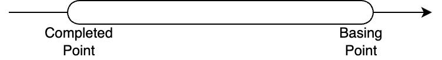

# 9. 動詞の活用

[TOP](../../readme.md)
/
[EN](../en/verbConjugation.md)

SFGPLでは，時制や相，助動詞などの動詞を修飾する語が備わっている．
これらの語は，主に，動詞に直接付属し修飾するものと，文全体に修飾するものが存在する．

## 動詞の時制

SFGPLでは以下の図のような動詞の時制が存在する．


このように，SFGPLでは①過去形，②現在形，③未来形の3つの時制が存在する．
これら時制は動詞の活用として基礎的なもので，文の時間の基準点となる．
時制を使用した例文は次の表のようになる．

|時制|English|SFGPL|
|:-:|:-:|:-:|
|①過去形|I lived in Tokyo.|di ta ga na sa 'live' li pun fa 'Tokyo'|
|②現在形|I live in Tokyo.|ta ga na sa 'live' li pun fa 'Tokyo'|
|③未来形|I will live in Tokyo.|du ta ga na sa 'live' li pun fa 'Tokyo'|

特に```di```と```du```では，文章自体に付属し形容する．

また，②の現在形は，何も付属しないことで，通常は現在のことを表す．
しかし，本来は不定時制であり，特に時制を必要としない場合にも使われる．

### 動詞の拡張時制

前項で説明した動詞は，一番基本的な動詞の時制の表し方である．
しかし，SFGPLではDeterminVクラスにによって，主に時制を組み合わせるための単語が存在する．
また，このDeterminerVクラスによる拡張時制は，Phraseクラスによる基礎時制より優先度が低く，基本的には基礎時制で文全体の時制を表す．
以下の表は拡張時制を表す単語である．

|時制|単語|
|:-:|:-:|
|①過去形|bak|
|②現在形|bik|
|③未来形|bok|

これらの時制を組み合わせることで，未来過去形や過去未来形などの複合時制を作ることができる．
次の例は，未来の時点で過去を表す未来過去形の例である．  

```SFGPL
du ta ga na bak sa 'live' li pun fa 'Tokyo'
```

まとめるとSFGPLにおける時制は以下の表のようなものが存在する．
以下の表の列名はPhraseによる基礎時制の種類，行名はDeterminerVによる拡張時制の種類を表している．
また，```A/B```でAは基礎時制，B拡張時制を表す，

||Past Tense|-|Future Tense|
|:-:|:-:|:-:|:-:|
|**-**|di/-|-/-|du/-|
|**Past Tense**|di/bak|-/bak|du/bak|
|**Present Tense**|di/bik|-/bik|du/bik|
|**Future Tense**|di/bok|-/bok|du/bok|

## 相

SFGPLでは下の図のように，①起動相，②経過相，③完結相，④継続相，⑤終了相，⑥進行相の6つが存在する．


"I wear dress"という意味の```te ga sa 'wear' fa 'dress'```について，それぞれの相での例文を次の表に示す．

|相|単語|English|SFGPL|
|:-:|:-:|:-:|:-:|
|①起動相|tak|I begin wear a dress.|te ga tak sa 'wear' fa 'dress'|
|②経過相|tek|I am (in the process of) wearing a dress.|te ga tek sa 'wear' fa 'dress'|
|③完結相|tik|I wear a dress. (I just finished wearing it.)|te ga tik sa 'wear' fa 'dress'|
|④継続相|tuk|I am wearing a dress. (The state in which it is worn.)|te ga tuk sa 'wear' fa 'dress'|
|⑤終了相|tok|I finish wear a dress. (I stopped wearing it.)|te ga tok sa 'wear' fa 'dress'|
|⑥進行相|ni|I am wearing a dress.|te ga ni sa 'wear' fa 'dress'|

これらの相は，現在形以外にも，過去形，未来形にできる．
⑥進行相は②経過相と④継続相が含まれている．
また③完結相と⑤終了相が同じである場合もある．
"I begin wear a dress."を過去形，未来形にすると次のようになる．

```SFGPL
di te ga tak sa 'wear' fa 'dress'
du te ga tak sa 'wear' fa 'dress'
```

また，原則として相単体では，時間の幅はなく，その瞬間だけを表す．
時間の幅を表す場合は，完了形を付け加える．
進行形に完了形を加えた"I have been wearing a dress."を表すには，次のようになる．

```SFGPL
te ga nu ni sa 'wear' fa 'dress'
```

### 一般的な進行形

SFGPLでは前節の①～⑤のような相を考えずに，⑥のように単純な進行形にすることができる．
SFGPLは次のように，"I am wearing the dress."という意味の進行形を表すことができる．

```SFGPL
te ga ni sa 'wear' fa 'dress'
```

進行形を表す```ni```は動詞に付属する．
これらは，現在形以外にも，過去形，未来形にできる．
"I am wearing the dress."を過去形，未来形にすると次のようになる．

```SFGPL
di te ga ni sa 'wear' fa 'dress'
du te ga ni sa 'wear' fa 'dress'
```

## 完了形

SFGPLでは，以下の図のような，英語と同等な完了形が存在する．



この完了形では過去に起こったことが続いていることを表す際に使用する．
3つの時制に対する完了形の例は次のようになる．

|時制|English|SFGPL|
|:-:|:-:|:-:|
|①過去完了形|I had lived in Tokyo.|di ta ga nu na sa 'live' li pun fa 'Tokyo'|
|②現在完了形|I have lived in Tokyo.|ta ga nu na sa 'live' li pun fa 'Tokyo'|
|③未来完了形|I will have lived in Tokyo.|du ta ga nu na sa 'live' li pun fa 'Tokyo'|

完了形を表す```nu```では，動詞自体に付属し，修飾する．

## SFGPLの時間表現のまとめ

SFGPLの時間表現に関しては，次の表のようなものが存在する．

|基本時制|拡張時制|完了相|完結相|
|:-:|:-:|:-:|:-:|
|-|-|-|-|
|di|bak|nu|tak|
|du|bik||tek|
||bok||tik|
||||tuk|
||||tok|
||||ni|

このように，SFGPLでは3×4×2×7=168通りの時間表現が存在し，あらゆる場面に対して表現することが可能である．

## 受動態

SFGPLは次のように，"The dress is worn."という意味の受動態を表すことができる．

```SFGPL
ta fa 'dress' ne sa 'wear'
```

受動態を表す```ne```は動詞に付属する．
これらは，現在形以外にも，過去形，未来形にできる．
"The dress is worn."を過去形，未来形にすると次のようになる．

```SFGPL
di ta fa 'dress' ne sa 'wear'
du ta fa 'dress' ne sa 'wear'
```

## その他の動詞の修飾

[DeterminerV](DeterminerV.md)クラス内の関数では，その他の動詞の修飾をすることができる．
また，それらは，英語の助動詞と似ている．

## 単語集

|English|SFGPL|
|:-:|:-:|
|I|ga|
|live|sa 'live'|
|in Tokyo|li pun fa 'Tokyo'|
|wear|sa 'wear'|
|dress|fa 'dress'|
