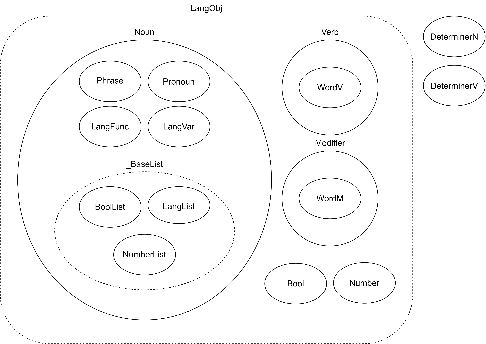

# About SFGPL

[TOP](../../readme.md)
/
[JP](../jp/aboutSFGPL.md)

## Introduction

SFGPL stands for "Simple Functional General Purpose Language" and is a language for formalising natural languages.
The language was designed to make sentence structure and meaning easily interpretable and communicable.
In particular, long and complex sentences containing conjunctions and relative pronouns are often difficult to interpret.
The language was created by me as a hobby and has not been rigorously tested, so there may be flaws.

## Background and purpose of creating the SFGPL

In the grammars of many natural languages, there are many exceptions and many cases that annoy the learner.
To solve this problem, artificial languages have been proposed for a universal language, but like many natural languages, they have ambiguous meanings and are open to multiple interpretations.
In particular, long and complex sentences containing conjunctions and relative pronouns are often difficult to interpret.
To solve these problems, the SFGPL is an artificial language created with the aim of making languages formally and logically understandable.

## SFGPL Features

SFGPL is a functional language and the types of arguments taken by functions are strictly defined.
In SFGPL, functions are assigned to each sentence structure, so that grammatical roles such as subject, predicate, object, and complement are easy to understand.
In addition, complex sentences can be created by combining sentence structures.

## Basic grammar of the SFGPL

- Only function words and a few words exist in the SFGPL and have a strictly defined meaning. Other words are borrowed from other languages.
- Function words are followed by a number of arguments, the meaning of which is determined by the arguments.
- In principle, each argument corresponds to a word or an object, but if the source word is more than one word, it can be regarded as a single word by connecting it with an underscore.
- Borrowed words are distinguished by placing a single quotation mark before and after them.
- There are no grammatical distinctions between genders, numbers, etc., and there are no articles.
- A semicolon (;) is added at the end of a sentence. However, it can be omitted in the case of a single sentence.

### Sentence structure of the SFGPL

The sentence structure of the SFGPL is strictly defined by proper words.
The following table shows the sentence structures that can be expressed in the SFGPL.
The details of how to use them are described in [Sentence Pattern](sentence_pattern.md).

|||word|function|arguments|supplement|
|:-:|:-:|:-:|:-:|:-:|:-:|
|1|S V|{noun_do}|Noun.do|S,V||
|2|S V C|{noun_eq}|Noun.eq|S,V,C|C is the noun|
|2|S V C|{noun_haveP}|Noun.haveP|S,V,C|C is the modifier|
|3|S V O|{noun_doT}|Noun.doT|S,V,O||
|4|S V O1 O2|{noun_give}|Noun.give|S,V,O1,O2||
|5|S V O C|{noun_makeN}|Noun.makeN|S,V,O,C|C is the noun|
|5|S V O C|{noun_makeM}|Noun.makeM|S,V,O,C|C is the modifier|
|-|A has B|{noun_have}|Noun.have|A,V,B||
|-|A belongs to B|{noun_belong}|Noun.belong|A,V,B||
|-|A is more B than C|{noun_gt}|Noun.gt|A,V,B,C||

## Pronunciation of SFGPL

There are no pronunciation exceptions in the SFGPL's native words.
The International Phonetic Alphabet (IPA) in the table below is an example of pronunciation.

Consonants of the SFGPL are listed in the table below.

|Spell|IPA|
|:-:|:-:|
|p|/p/|
|b|/b/|
|f|/f/|
|m|/m/|
|t|/t/|
|d|/d/|
|s|/s/|
|n|/n/|
|l|/l/|
|k|/k/|
|g|/g/|
|w|/w/|

On the other hand, the vowels in the SFGPL are as shown in the table below.

|Spell|IPA|
|:-:|:-:|
|a|/a/|
|e|/e/|
|i|/i/|
|u|/u/|
|o|/o/|

Borrowed words are read with the pronunciation specific to the borrowed words.

## Parts of speech in the SFGPL

There are three parts of speech in the SFGPL: Noun, Verb and Modifier.
Phrase and Pronoun exist as subclasses of Noun.
Furthermore, there are two special words that modify nouns: noun determiners (DeterminerN).
Each part of speech has its own function words, which change the part of speech and determine its meaning.
Other words that implement the basic vocabulary are Word.
The SFGPL's specific words are classified according to their parts of speech: verbs are "WordV", modifiers are "WordM".

Nouns are words that describe any concept, such as any object, substance, person or place.
Verbs are words that describe any action, action, state, being, etc. Modifiers are words that modify other words.
Modifiers are words that modify other words; the SFGPL makes no distinction between adjectives and adverbs.

In the Python library SFGPL, there are classes for each part of speech.

## Function words in the SFGPL

Function words determine the role, part of speech, etc. of a sentence.
The function, role and meaning of function words are only applicable within arguments.

These function words are one-to-one with Python functions.
They also have a fixed number of arguments, and the role of each argument is determined by its location.

For a list of function words and how to use them, see [dict.csv](../../dict.csv).

## Borrowed words in the SFGPL

Borrowed words are used for words that do not exist in the SFGPL.
It is preferable to borrow words from languages commonly used in the world, such as English, but this should not be a problem as long as the words can be understood by others.
However, it is recommended that borrowed words are used in their original form, and if there is a conjugation, it should be done in SFGPL function words.

## SFGPL and programming

SFGPL sentences can be rewritten into Python objects.
This project contains a file in which the SFGPL is defined.
To use the SFGPL in Python, use [SFGPL.py](../../SFGPL/SFGPL.py) can be used by importing it.
Examples of use are [samples](../../py/samples) in the Python files.
Also, to install and uninstall the SFGPL library by pip, use [How2InstallAndUninstall.ipynb](../../How2InstallAndUninstall.ipynb).
