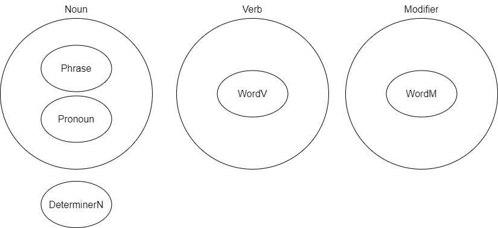

# SFGPLについて

[TOP](../../readme.md)
/
[EN](../en/aboutSFGPL.md)

## はじめに

SFGPLは"Simple Functional General Purpose Language"の略で，自然言語を形式化するための言語である．
この言語は，文の構造や意味を容易に解釈でき，かつコミュニケーションができるようにするために考案した言語である．

また，この言語は私が趣味で作成したものであり，厳密に検証を行っていないため不備等がある可能性がある．

## SFGPL作成の背景と目的

多くの自然言語の文法では，多くの例外や存在し，学習者を悩ませることが多い．
また，それを解決するために，世界共通語を目的とした人工言語が提案されたが，それらは多くの自然言語と同様に曖昧な意味や複数の解釈ができる場合が存在する．
特に，接続詞や関係代名詞などを含む，長くて複雑な文章は解釈が困難であることが多い．
それらを解決するために，形式的，論理的に理解できるような言語を目的として作成した人工言語がSFGPLである．

## SFGPLの特徴

SFGPLでは，関数型の言語で，また関数のとる引数の型が厳密に定義されている．
SFGPLでは，文構造それぞれに関数が割り振られているため，主語，述語，目的語，補語などの文法上の役割が分かりやすくなっている．
また，文構造を組み合わせることによって複雑な文章を作成することができる．

## SFGPLの基本文法

- SFGPLには機能語と少しの単語のみが存在し，厳密に定義された意味を持つ．その他の単語は他の言語から借用される．
- 機能語の後にはいくつかの引数が付き，その引数によって意味が決まる．
- 原則として，各引数は1つの単語または1つのオブジェクトに対応するが，原語が複数の単語である場合は，アンダースコアで接続することで1つの単語とみなすことができる．
- 借用語の前後にはシングルクォーテーションを付けることで区別する．
- 文法上の性や数などの区別をすることはなく，また，冠詞も存在しない．
- 文末にはセミコロン(;)を付ける．ただし，単文の場合は省略可能である．

### SFGPLの文構造

SFGPLでは固有語によって，文構造が厳密に定義されている．
以下の表は，SFGPLで表現できる文構造の表である．
また使用方法等の詳細は，[文型](sentence_pattern.md)に記述してある．

|||単語|関数|引数|補足|
|:-:|:-:|:-:|:-:|:-:|:-:|
|1|S V|{noun_do}|Noun.do|S,V||
|2|S V C|{noun_eq}|Noun.eq|S,V,C|Cが名詞|
|2|S V C|{noun_haveP}|Noun.haveP|S,V,C|Cが修飾語|
|3|S V O|{noun_doT}|Noun.doT|S,V,O||
|4|S V O1 O2|{noun_give}|Noun.give|S,V,O1,O2||
|5|S V O C|{noun_makeN}|Noun.makeN|S,V,O,C|Cが名詞|
|5|S V O C|{noun_makeM}|Noun.makeM|S,V,O,C|Cが修飾語|
|-|A has B|{noun_have}|Noun.have|A,V,B|AがBを所有している|
|-|A belongs to B|{noun_belong}|Noun.belong|A,V,B|AがBに所属している|
|-|A is more B than C|{noun_gt}|Noun.gt|A,V,B,C|AがCよりBである|

## SFGPLの発音

SFGPLの固有単語においては，発音の例外が存在しない．
また，以下の表の国際音声記号(IPA)は発音例である．

SFGPLの子音は次の表のようなものがある．

|表記|IPA|
|:-:|:-:|
|p|/p/|
|b|/b/|
|f|/f/|
|m|/m/|
|t|/t/|
|d|/d/|
|s|/s/|
|n|/n/|
|l|/l/|
|k|/k/|
|g|/g/|
|w|/w/|

一方，SFGPLの母音は次の表のようなものがある．

|表記|IPA|
|:-:|:-:|
|a|/a/|
|e|/e/|
|i|/i/|
|u|/u/|
|o|/o/|

また，借用語は借用語固有の発音で読む．

## SFGPLの単語

SFGPLの[単語](Word.md)は主に，SFGPLの固有の単語と借用語に分かれる．

固有単語は，主に文構造に必要な機能語と，動詞と修飾語の基礎単語が存在する．
またそれ以外は，借用語が使用される．

そして，SFGPLの文構造では，品詞の場所が決定されており，それに従った品詞の単語を使わなければならない．

### SFGPLの品詞

SFGPLの品詞は名詞(Noun)，動詞(Verb)，修飾詞(Modifier)の三種類がある．
また，名詞のサブクラスとして句(Phrase)，代名詞（Pronoun），Bool配列型（BoolList），LangListとLangFuncが存在する．
BoolList，LangList，LangFuncは一般的な文以外に論理的な文を作る際に使用される．
さらに，名詞や動詞を修飾する特殊な語として，名詞限定語（DeterminerN）と動詞限定語（DeterminerV）が存在する．
そして，真偽を表すBool型が存在する．

それぞれの品詞にはそれぞれ特有の関数（機能語）が存在し，それによって品詞の変更や意味の決定などが行われる．
その他に，基礎単語を実装する，単語（Word）が存在する．
単語は，品詞別に動詞の単語の"WordV"，修飾語の単語の"WordM"が存在する．

名詞は，あらゆる物体，物質，人物，場所などのあらゆる概念を表す語である．
動詞は，あらゆる動作，作用，状態，存在などを表す語である．
修飾語は，他の語を修飾する語である．SFGPLでは形容詞と副詞の区別はつけない．

PythonライブラリSFGPLでは品詞ごとにクラスが存在する．

### SFGPLの機能語

機能語により，文の役割や品詞等の決定がされる．
機能語の機能，役割や意味は引数内でのみしか適応されない．

この機能語らは，Pythonの関数と一対一となっている．
また，引数の数も決まっていて，引数の場所によって，役割が決まっている．

機能語の一覧と利用方法は，[dict.csv](../../dict.csv)に記述されている．

### SFGPLの借用語

SFGPLで存在しない単語は借用語を使用する．
借用語は，英語などの世界でよく使われる言語から借用することが好ましいが，相手に伝わる単語であれば問題とはならないはずである．
ただし，借用語は原型で使い，活用がある場合はSFGPLの機能語で行うことを推奨している．

## SFGPLとプログラミング

SFGPLの文は，Pythonオブジェクトに書き換えることができる．
このプロジェクトは，SFGPLが定義されているファイルが含まれている．
PythonでSFGPLを使用するためには，[SFGPL.py](../../SFGPL/SFGPL.py)をインポートすることで使用することができる．
使用例は[samples](../../py/samples)のPythonファイルに記載されている．
また，PythonでのSFGPLライブラリの詳細な実行方法は，[How_to_Use_SFGPL_in_Python.ipynb](../../How_to_Use_SFGPL_in_Python.ipynb)に記載されている．
